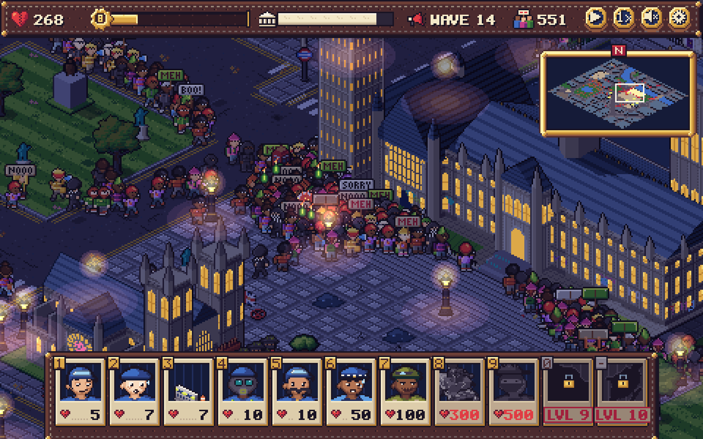
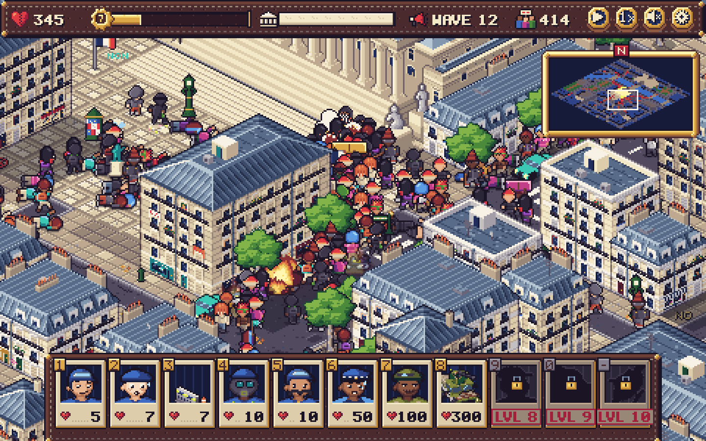
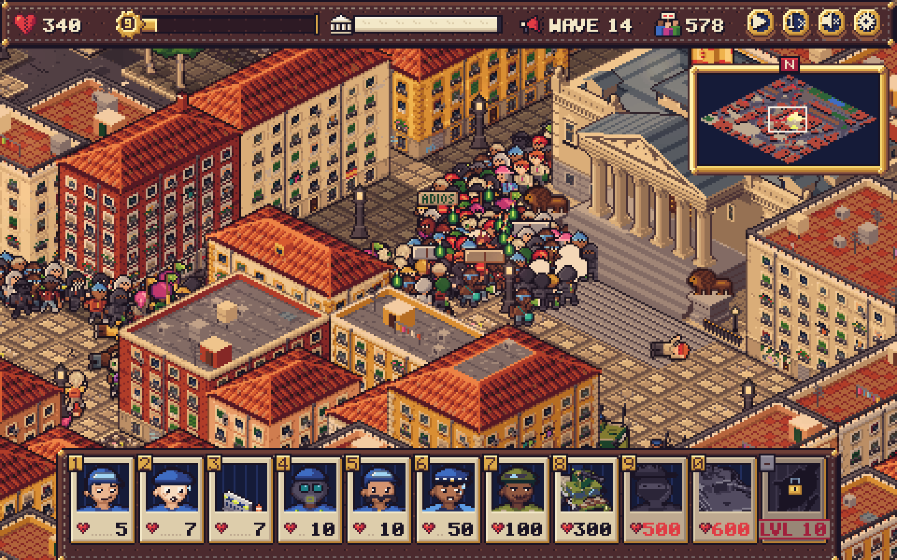
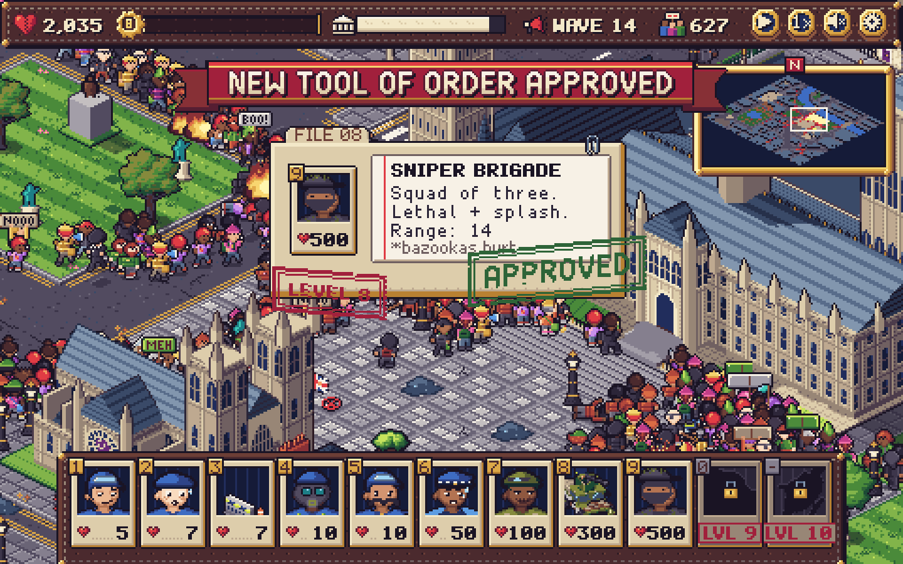
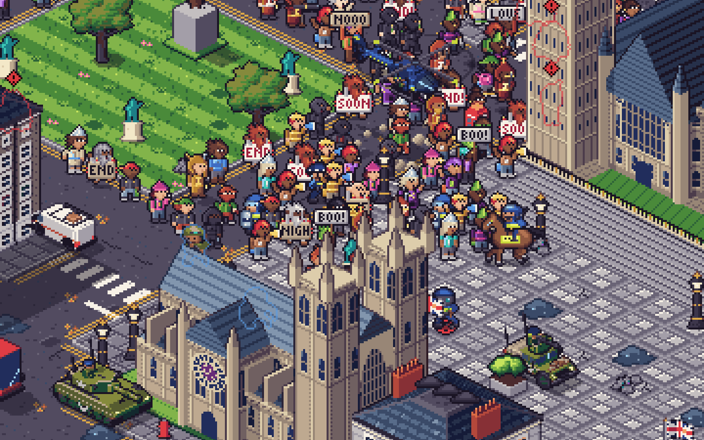
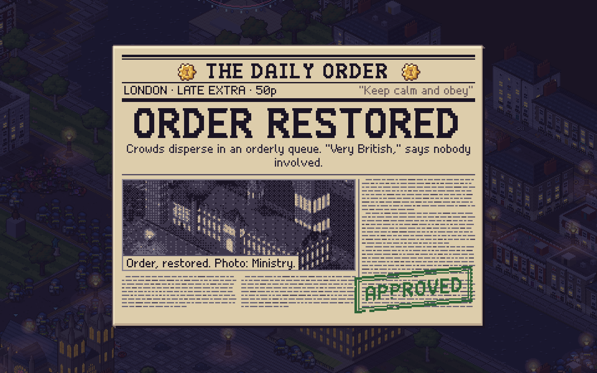
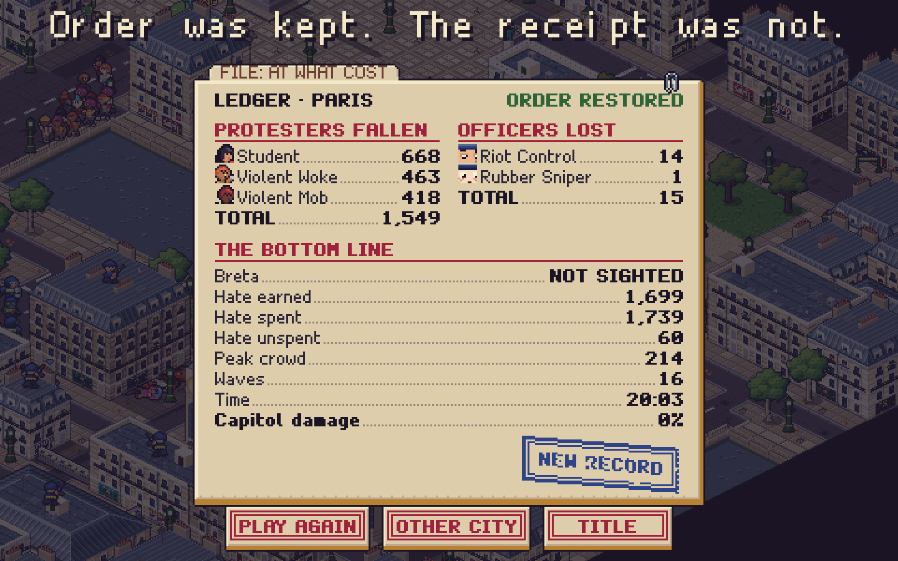
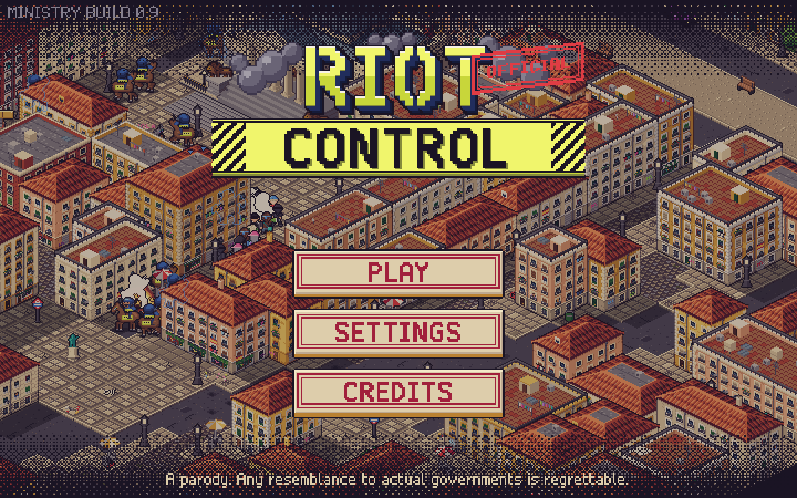
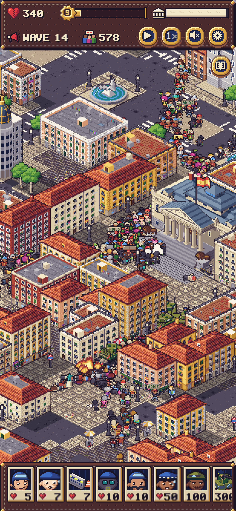

# RIOT CONTROL

**An isometric pixel-art horde defence parody. Thousands of protesters march on the Capitol, and every officer you lose makes the Ministry _more_ legitimate.**

_"Order has been restored. But at what cost?"_



Hold the parliament of **Madrid, London or Paris** against escalating waves of students,
black bloc, tinfoil-hat gunmen and a fictional doomsday cult. Spend **Hate** on riot police,
rooftop snipers, tear gas, Humvees, tanks and an invulnerable helicopter. Both sides are the joke.

**Play in the browser:** <https://gbt3101.github.io/RiotControl/> (desktop and mobile, no install).

|                                                                                                                     |                                                                                                                   |
| ------------------------------------------------------------------------------------------------------------------- | ----------------------------------------------------------------------------------------------------------------- |
|  |        |
|        |  |
|                           |           |

<p align="center">
  
  &nbsp;
  
</p>

---

## How to play

**The loop.** Place units during the prep phase and press **Let them come**. Protesters pour
out of front doors across the city, merge into crowds and flow along the streets toward the
Capitol. Anyone who reaches the steps damages its **Integrity**. If it reaches 0, _the regime
has fallen_. Reach **5000 Legitimacy** to win.

**The economy is the satire:**

- **Hate** is your currency. You start with 100. Every protester down gives **+1** (Breta gives +100), and every officer lost gives **+10**.
- **Legitimacy** grows only when _your own_ units die, by 5 to 100 per unit type. It levels you up.
- Each level unlocks a new tool of order, and the protesters escalate with you.

| Lvl | Legitimacy | You unlock                                     | They bring                            |
| --: | ---------: | ---------------------------------------------- | ------------------------------------- |
|   0 |          0 | Riot Control (shield + baton, guards rooftops) | Students, Violent Woke                |
|   1 |         10 | Rubber Sniper (rooftops)                       |                                       |
|   2 |         30 | Blockade                                       | Violent Mob                           |
|   3 |         50 | Tear Gas Shooter (grenade ability)             |                                       |
|   4 |        100 | Mounted Riot Police _(commandable)_            | Very Violent Mob (molotovs)           |
|   5 |        200 | Armed Cops (lethal, piercing)                  |                                       |
|   6 |        300 | Soldiers                                       | Crazy Mob (guns)                      |
|   7 |        500 | MG Humvee _(commandable)_                      |                                       |
|   8 |        800 | Sniper Brigade (rooftops, splash)              | Doomsday Cultists (bazookas vs roofs) |
|   9 |       1200 | Tank _(commandable, crushes, friendly fire)_   |                                       |
|  10 |       2000 | Helicopter _(commandable, invulnerable)_       | The Prophets (explode on contact)     |
|     |   **5000** | **Victory**                                    |                                       |

**Protesters** are all visually unique: each is a seeded paper doll with its own hair, clothes, sign and gait.
Students just want to get there. The Woke and the mobs **climb unguarded buildings and throw
your snipers off the roof**. Guard a roof by keeping Riot Control nearby. Very Violent Mobs throw
molotovs, the Crazy Mob shoots back, the Order of the Final Hour fires bazookas at rooftops, and its
Prophets sprint at your lines and explode. 1% of spawn groups bring **Breta** and her
paparazzi.

**Controls**

|                                     | Desktop                                                                                       | Mobile                          |
| ----------------------------------- | --------------------------------------------------------------------------------------------- | ------------------------------- |
| Pan / zoom                          | drag, WASD / arrows · wheel, `+` / numpad `−`                                                 | one-finger drag · pinch         |
| Deploy                              | click a card (or `1`–`0`, `-`) → click a glowing tile · `Shift` keeps placing · `Esc` cancels | tap card → tap tile → ✔ confirm |
| Command (horse, Humvee, tank, heli) | click unit → click destination                                                                | tap unit → tap destination      |
| Tear-gas grenade                    | click the charged unit, or `G` for all                                                        | tap the charged unit            |
| Waves / pause / speed               | `Enter` · `Space` · `F` (1×/2×/3×)                                                            | HUD buttons                     |
| Other                               | `M` mute · `Tab` minimap · `Esc` menu                                                         | ⚙ settings                      |

A short, skippable briefing from the Minister of the Interior runs on your first game in each city.
You can replay it from Settings.

## Cities

| City       | Capitol                   | Notes                                                                               |
| ---------- | ------------------------- | ----------------------------------------------------------------------------------- |
| **Madrid** | Congreso de los Diputados | Sol, Gran Vía, Cibeles, Neptune, the Prado; Retiro Park covers the flank            |
| **London** | Palace of Westminster     | Big Ben, the Abbey, Whitehall, Trafalgar Square; the Thames bridges are chokepoints |
| **Paris**  | Assemblée nationale       | Pont de la Concorde, the obelisk, Invalides, Orsay; the Seine to the north          |

All three are condensed and redrawn from geographic knowledge, not traced from map tiles. Each
has its own day/night cycle, street signs, newspaper masthead (_El Orden_, _The Daily Order_,
_L'Ordre du Jour_) and local flavour.

## Run, build, test

Node 22.

```bash
npm ci
npm run dev          # Vite dev server → http://localhost:5173/
npm run build        # static build into dist/ (base './', works from any sub-path)
npm run preview      # serve dist/
npm test             # Vitest: sim, balance, palette compliance, UI logic (~25 s)
npm run check        # typecheck + lint + test + build
```

| Tool                                          | What it does                                                                                 |
| --------------------------------------------- | -------------------------------------------------------------------------------------------- |
| `npm run playtest`                            | headless bot games per city and strategy → balance report (`docs/M12.md`)                    |
| `npm run soak`                                | Playwright soak: full games, UI flows, perf probes, touch-target audit                       |
| `npm run smoke`                               | interaction smoke test on `dist/` (drag, wheel, pinch, taps, keys)                           |
| `npm run shots`                               | build + headless screenshots of the game (desktop, phone landscape and portrait) and gallery |
| `npm run sprites -- --filter riot --scale 10` | export sprites to PNG without a browser (fast art loop)                                      |

**Dev pages** (in the build, not linked from the game): `gallery.html` (every sprite, `?group=units|buildings|ui|…`),
`maps.html` (city blueprints, `?city=london`), `audio.html` (audition every SFX and the adaptive music).

**Debug params** (`index.html?…`):

- `city=madrid|london|paris` skips the title screen.
- `autoplay=1&t=60` lets a bot play, fast-forwarded 60 s.
- `level=7&hate=1500&wave=12` jumps the economy.
- `tod=0.75` gives night, `tod=0.4` golden hour.
- `zoom=3&focus=crowd` sets the camera.
- `scene=showcase|gas|climb` loads a debug scenario.
- `moment=levelup|victory|defeat|…` triggers a UI moment.
- `freeze` holds the sim (for shots).
- `stress=3000` spawns 3000 protesters (perf).
- `tutorial=0&hints=0&mute` turns off the tutorial, hints and audio.

Full list in [`docs/M8.md`](docs/M8.md) §7 and [`docs/M9.md`](docs/M9.md).

Example: `?city=london&autoplay=1&stress=600&t=22&level=8&hate=2500&wave=14&focus=crowd&tod=0.75&zoom=3&freeze&tutorial=0&hints=0`

## How it's made

- **Stack:** TypeScript (strict), Vite, PixiJS v8 (WebGL), Vitest, Playwright. The only runtime dependency is Pixi.
- **Art in code:** there are no image files. Every sprite is generated at boot from
  hand-authored pixel grids, paper-doll modules and small painters. That covers buildings, three
  Capitols with five damage states each, units in 8 directions, vehicles, FX, fonts, the UI kit
  and the newspapers. Everything sits on a 64-colour palette (_RIOT-64_), with the sun from the
  upper left and coloured outlines.
  A test enforces palette compliance. The art is painted in Web Workers, packed into atlases and
  cached in IndexedDB, so a repeat visit boots in about a second.
- **Pixel-perfect rendering:** integer zoom only, one device pixel per art pixel on any DPR,
  depth-sliced isometric buildings and x-ray ghosts for allies hidden behind blocks.
- **Deterministic simulation:** a fixed 30 Hz structure-of-arrays sim with seeded RNG and flow
  fields. It runs up to 3000 concurrent protesters on desktop and tiers itself down on phones.
  The same sim runs headless for the balance bots.
- **Procedural audio:** every SFX, the crowd bed and the adaptive music are synthesised live with
  WebAudio. There are no audio files.

## Docs map

|                                                            |                                                                       |
| ---------------------------------------------------------- | --------------------------------------------------------------------- |
| [`PLAN.md`](PLAN.md)                                       | the source of truth: design, art bible, architecture, milestones      |
| [`HANDOFF.md`](HANDOFF.md)                                 | live status, how to run, decisions, known issues                      |
| [`docs/M2.md`](docs/M2.md)                                 | city blueprints and map format                                        |
| [`docs/art/`](docs/art)                                    | art milestones M3a to M5, plus M13a polish notes                      |
| [`docs/M6.md`](docs/M6.md), [`docs/M8.md`](docs/M8.md)     | simulation core · rendering integration, asset pipeline, debug params |
| [`docs/M9.md`](docs/M9.md), [`docs/M10.md`](docs/M10.md)   | UI/UX and screens · tutorial, hints and writing                       |
| [`docs/M11.md`](docs/M11.md), [`docs/M12.md`](docs/M12.md) | procedural audio · balance and bots                                   |
| [`docs/M13b.md`](docs/M13b.md)                             | UX, performance, mobile and the soak tool                             |
| [`docs/progress/`](docs/progress)                          | screenshots from every milestone                                      |

## Credits

Designed by the product owner. Built by Claude agents, with every pixel of the art authored in code.

## A note on tone

Riot Control is satire aimed at **both** sides. The Ministry is a cynical machine that profits
from its own losses. The protesters are earnest, absurd, violent and always filming. No real
group is targeted. The doomsday cult (_The Order of the Final Hour_) is entirely fictional and
references no real religion. No real people are depicted, apart from one gentle parody
(Breta). The violence is cartoonish: KO stars for non-lethal hits and small pixel blood for lethal ones.
