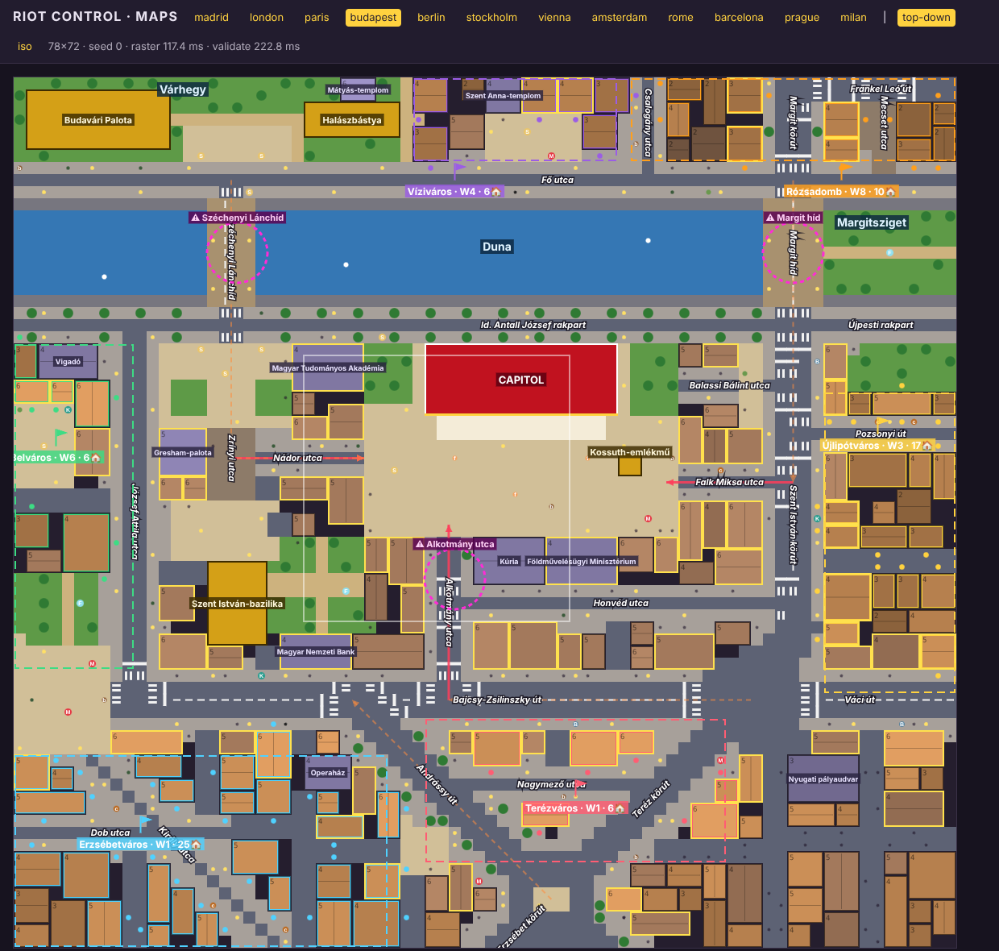
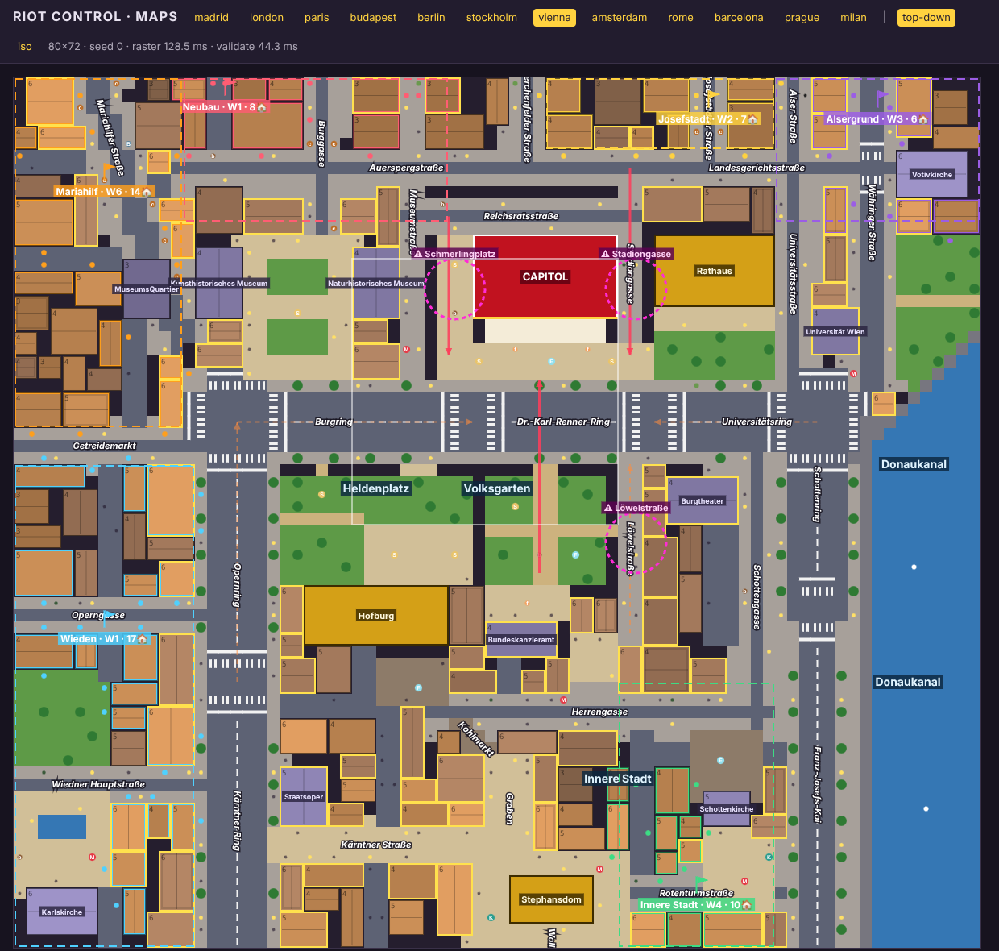
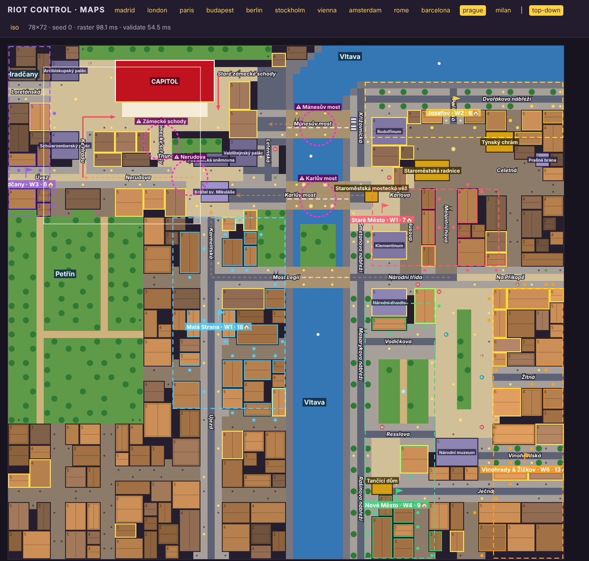

# E2 Central: city blueprints for Budapest, Vienna and Prague

Three hand-authored blueprints in the M2 format (docs/M2.md). Each one is registered with one line
in `src/maps/cities/index.ts`, and its key streets are pinned in `REQUIRED_STREETS`
(tests/maps-blueprints.test.ts). All three pass every validator for seeds 0–12.

| City     | File                          | Size  | Capitol (contract)     | Landmarks placed                                   | Districts | Chokepoints |
| -------- | ----------------------------- | ----- | ---------------------- | -------------------------------------------------- | --------- | ----------- |
| Budapest | `src/maps/cities/budapest.ts` | 78×72 | Országház 16×6         | budaCastle, fishermansBastion, stStephens, kossuth | 6         | 3           |
| Vienna   | `src/maps/cities/vienna.ts`   | 80×72 | Parlament 12×7         | rathaus, hofburg, stephansdom                      | 6         | 3           |
| Prague   | `src/maps/cities/prague.ts`   | 78×72 | Castle + St Vitus 14×6 | bridgeTower, oldTownHall, tynChurch, dancingHouse  | 6         | 4           |

All three follow the M2 convention: the Capitol's steps face +j (toward the camera) and the open
ground in front of them (Kossuth tér, the Ring, the Na Valech terrace) gives the camera a wide,
unobstructed approach. Geography is drawn from memory (OSM is blocked), redrawn rather than traced,
and condensed about 2–3× around the Capitol.

## Budapest (level 1, tutorial city)

**Orientation:** real north is +i (right) and real east is +j (down), a 90° clockwise rotation
of the real map. The Danube runs along i behind the Parliament, and the Parliament's main east
front faces Kossuth Lajos tér.

- **Buda (top):** Buda Castle (Budavári Palota) and the Fisherman's Bastion with the
  Mátyás-templom sit on the wooded Várhegy. Clark Ádám tér is at the foot of the hill. Fő utca runs
  along the river. Batthyány tér (St Anne's) sits directly opposite the Parliament. Further up are
  Csalogány utca, Margit körút, Frankel Leó út and Mecset utca in Rózsadomb.
- **The river:** there are two crossings. The Széchenyi Lánchíd (left, with lions at both ends)
  lands on Széchenyi István tér, which lines up with Zrínyi utca and the Basilica. The Margit híd
  (right) continues straight into the Szent István körút, with Margitsziget just north of it.
- **Pest:** the Id. Antall József rakpart (tram 2) runs behind the Parliament. Kossuth tér wraps
  the building and contains the Kossuth memorial, Rákóczi on horseback and the national flag. The
  Kúria and the Ministry of Agriculture close the square's east side. Szabadság tér (Nemzeti Bank),
  Szent István tér with the Basilica, Gresham-palota and the Academy are south of the square.
  Bajcsy-Zsilinszky út runs from Deák tér to Nyugati and continues as Váci út. Andrássy út (with the
  Opera) and the Teréz körút meet at the Oktogon as exact 45° diagonals, and the Erzsébet körút
  continues beyond. Other streets: Nagymező utca, Liszt Ferenc tér, Király utca, Dob utca, József
  Attila utca, Vörösmarty tér, Erzsébet tér, Honvéd utca, Falk Miksa utca, Balassi Bálint utca,
  Pozsonyi út, Újpesti rakpart.
- **Final approaches (three, all readable):** Alkotmány utca from the east, Nádor utca from the
  south (Széchenyi tér and the Chain Bridge) and Falk Miksa or Balassi Bálint utca from the north
  (Nagykörút and Margaret Bridge). The square's east side has no alleys (`noLanes`), so these
  three are the only ways in.
- **Chokepoints:** **Alkotmány utca** is the tutorial `{choke}`, because it is the chokepoint
  nearest the steps. Both wave-1 districts funnel down it: "More cops on Alkotmány utca, close
  together." The other two are the **Széchenyi Lánchíd** and the **Margit híd**.
- **Spawn waves:** these are deliberately staggered for the first level.
  - W1: Terézváros (east) and Erzsébetváros (south-east). Both march down Bajcsy-Zsilinszky út
    into Alkotmány utca.
  - W3: Újlipótváros, which comes down the Nagykörút and arrives at the square's north end.
  - W4: Víziváros (Buda), across the Chain Bridge.
  - W6: Belváros, via Nádor utca.
  - W8: Rózsadomb (Buda), across Margaret Bridge.

## Vienna

**Orientation:** the same rotation as Budapest (north +i, east +j). The Ringstraße is drawn as
the U it really is around the Innere Stadt:

- The **west leg** runs along i in front of the Parlament: Burgring, then Dr.-Karl-Renner-Ring,
  then Universitätsring.
- The **Opernring and Kärntner Ring** turn along j at the left (real south).
- The **Schottenring** turns along j at the right, then becomes the **Franz-Josefs-Kai** beside
  the **Donaukanal** at the far north-east edge. The canal bends off the map toward the Roßauer
  Lände.

The rest of the city, by area:

- **Outside the Ring, behind the Parlament (top):**
  - The forecourt with the Pallas-Athene fountain and the Rossebändiger statues, Reichsratsstraße,
    Schmerlingplatz and Stadiongasse.
  - The Rathaus behind the Rathausplatz and the Rathauspark.
  - The Universität and the Votivkirche with the Sigmund-Freud-Park.
  - Maria-Theresien-Platz between the Kunsthistorisches and Naturhistorisches Museum, and the
    MuseumsQuartier.
  - Mariahilfer Straße heading off to the south-west.
  - Streets: Museumstraße, Burggasse, Lerchenfelder Straße, Josefstädter Straße, Auerspergstraße,
    Landesgerichtsstraße, Universitätsstraße, Alser Straße, Währinger Straße.
- **Inside the Ring:**
  - The fenced Volksgarten, which has gates on the Ring, Ballhausplatz and Löwelstraße.
  - The Heldenplatz, with the Äußeres Burgtor in its railing and the two equestrian statues. The
    Neue Burg (`hofburg`) stands on its far side, with the Burggarten beside it.
  - The Burgtheater, opposite the Rathaus.
  - Ballhausplatz (Bundeskanzleramt) and Minoritenplatz.
  - Michaelerplatz and Herrengasse up to the Freyung (Schottenkirche).
  - Kohlmarkt, then the Graben, then Stephansplatz with the Stephansdom.
  - Kärntner Straße from the Staatsoper, Rotenturmstraße to Schwedenplatz, and Schottengasse.
- **Beyond the Opernring:** Wieden, Karlsplatz (Karlskirche, pond), Resselpark, Operngasse,
  Getreidemarkt and Wiedner Hauptstraße.

**The barrier:** the Ring itself plus the Hofburg and Volksgarten park mass. The Innere Stadt reaches
the Parlament only through Löwelstraße, the Volksgarten gates or the Burgtor, or round the Ring.
The outer districts come round the Parlament's flanks or down the Ring.

- **Final approaches:** Stadiongasse (north flank), Schmerlingplatz (south flank) and across the
  Ring from the Volksgarten. The Ring legs (Universitätsring, Burgring, Opernring) feed them.
- **Chokepoints:** Stadiongasse, Schmerlingplatz and Löwelstraße.
- **Spawn waves:**
  - W1: Neubau via Museumstraße or Reichsratsstraße to Schmerlingplatz, and Wieden via the
    Opernring and Burgring. These are the two longer marches; Josefstadt sits right behind the
    Parlament, only 30 tiles from the steps.
  - W2: Josefstadt, via Landesgerichtsstraße and Stadiongasse.
  - W3: Alsergrund, via Landesgerichtsstraße and Stadiongasse.
  - W4: Innere Stadt, via Löwelstraße.
  - W6: Mariahilf, via Mariahilfer Straße.

## Prague

**Orientation:** north-up and unrotated (north is −j, east is +i). The Castle's long south front,
the panorama over the Malá Strana roofs, faces +j onto the **Na Valech** rampart terrace.

- **The Castle hill:** the slope under the terrace is a band of palaces and walled gardens with no
  through lanes (`noLanes`). It includes the Zahrady pod Pražským hradem, the Poslanecká sněmovna,
  the Valdštejnský palác (Senate) and the Schwarzenberský palác. The only ways up are three long
  uphill routes, and they are the natural chokepoints:
  - **Nerudova**, then **Ke Hradu**, to **Hradčanské náměstí** at the Castle's west end
    (Arcibiskupský palác). Úvoz and Loretánská continue west into Hradčany.
  - **Zámecké schody**, which climb from **Thunovská**. Thunovská is reached off Nerudova, as
    Zámecká is in reality.
  - **Staré zámecké schody**, from Klárov up to the east gate forecourt (Na Opyši).

  The Stag Moat and Royal Garden lie behind the Castle (top).

- **Steps:** the contract's `steps` ground only exists in front of the Capitol (rasterize.ts), and
  it is not `PLACEABLE_ROAD`. The stairways are therefore drawn as narrow paved streets
  (`surface: 'plaza'`) so that officers can hold them. See _Requested shared changes_.
- **The Vltava:** the river runs north–south east of Malá Strana and bends east across the top past
  Josefov. It has three crossings:
  - **Karlův most**, from Mostecká and Malostranské náměstí (St Nicholas). The Old Town Bridge
    Tower (`bridgeTower`) stands astride its Staré Město end on Křižovnické náměstí, so crowds file
    round it.
  - **Mánesův most**, between Klárov and the Rudolfinum.
  - **Most Legií**, between Národní třída and Újezd, over Střelecký ostrov.

  Kampa sits on the west bank.

- **Staré Město:** Karlova, the Klementinum, Staroměstské náměstí (Old Town Hall with the
  astronomical clock, Týn Church, the Hus monument), Celetná to the Prašná brána, Melantrichova
  and Husova down to Národní třída and Na Příkopě. Josefov has Pařížská and the Dvořákovo nábřeží.
- **Nové Město:** Národní divadlo, Václavské náměstí (central gardens, St Wenceslas on horseback,
  Národní muzeum at the top), Vodičkova, Karlovo náměstí, Resslova, Ječná, Žitná. The Dancing
  House (`dancingHouse`) stands on Jiráskovo náměstí on the Rašínovo nábřeží, with the Masarykovo
  and Smetanovo nábřeží further north. The Vinohradská leads off to Vinohrady and Žižkov at the
  east edge.
- **West bank:** Petřín's wooded hill fills the south-west, with Karmelitská and Újezd at its foot.
- **Final approaches:** Ke Hradu to Hradčanské náměstí, Zámecké schody, and Staré zámecké schody.
- **Chokepoints:** Zámecké schody, Nerudova, Karlův most and Mánesův most.
- **Spawn waves:**
  - W1: Staré Město, over Karlův most, up Nerudova to the Zámecké schody.
  - W1: Malá Strana, via Újezd, Karmelitská and Nerudova.
  - W2: Josefov, over Mánesův most, Klárov and the Old Castle Steps.
  - W3: Hradčany, via Úvoz or Loretánská and Ke Hradu.
  - W4: Nové Město.
  - W6: Vinohrady & Žižkov.

## Verification

- **Validators:** `validateMap` reports no errors for seeds 0–12 in all three cities, and
  `npx vitest run tests/maps-blueprints.test.ts -t "budapest|vienna|prague"` passes (47 tests).
  Every spawn door and rally point reaches the steps, and every final approach is redundant.
- **Headless playtests:** `npm run playtest -- --cities <city> --bots balanced --seeds 1 --minutes 10`
  runs without errors for all three. At 10 minutes the Capitol's integrity is 100% in Budapest,
  53% in Vienna and 98% in Prague. For comparison, London is at 41% and Paris at 69% with the
  same probe on the current tree.

  I also ran full-length games (balanced bot, seeds 1–2). Budapest won once (51 min, integrity
  never below 100%) and lost once (13 min). Vienna lost twice (12 and 14 min) and Prague lost
  twice (32 and 34 min). The original cities show the same spread on the current tree: Madrid
  won once and lost once (47 min), London lost at 9 and 11 min, and Paris lost at 16 and 31 min.
  Per-city balance is left to E6.

- **Crowd flow:** I ran a 10-minute balanced-bot game and counted the unique protesters seen on
  each chokepoint and approach. Protesters do use the bridges and chokepoints.

  **Budapest**
  - Alkotmány utca: 83 protesters, from Terézváros and Erzsébetváros, the two wave-1 districts.
  - Nádor utca: 66, from Erzsébetváros and Belváros.
  - Falk Miksa utca: 41, from Újlipótváros.
  - Széchenyi Lánchíd: 36, from Víziváros.
  - Margit híd: 72, from Rózsadomb and northern Víziváros.
  - Andrássy út also carries part of Erzsébetváros.

  **Vienna**
  - Stadiongasse: 110, from Josefstadt and Alsergrund.
  - Schmerlingplatz: 45, from Neubau, Wieden and Mariahilf.
  - Löwelstraße: 37, all from the Innere Stadt.
  - The Burgring and Opernring carry Wieden.
  - The crossing over the Ring from the Volksgarten is never chosen. It stays as a redundant way
    in.

  **Prague**
  - Mánesův most: 100, from Josefov and the north of the Old Town.
  - Karlův most: 22–52, from the Staré Město.
  - Most Legií: Nové Město and Vinohrady.
  - Nerudova: 87.
  - Ke Hradu: 81, from Hradčany and Malá Strana.
  - Old Castle Steps: 63.
  - Zámecké schody: 20–27.

- **Visual checks:** I took flat-colour viewer screenshots (above) and flat-iso viewer screenshots,
  and an in-game shot with the stand-in art. Kossuth tér reads as Kossuth tér, with the
  Országház art that E4 already has in progress.

## Known simplifications

- **Budapest:** the river is about 7 tiles wide, narrower than the real Danube relative to the
  city. Margaret Bridge is drawn straight; the real bridge bends at the island. The Nagykörút is
  simplified to a straight Szent István körút plus 45° diagonals for the Teréz körút and Andrássy
  út. Vértanúk tere and Vécsey utca are omitted, so Szabadság tér does not open onto Kossuth tér.
- **Vienna:** the Ring's polygon is drawn as a right-angled U, so the Burgring corner is square,
  not the real chamfer. The Donaukanal runs along the right edge, with no Leopoldstadt bank or
  bridges on the map. The Parlament has no separate ramp geometry; its forecourt is a 3-row plaza
  on the Ring.
- **Prague:** Wenceslas Square runs north–south here, while the real square runs north-west to
  south-east. Josefov is a thin strip along the Dvořákovo nábřeží. The stairways are paved
  streets, not stair tiles.
- **No city-only decor kinds are used.** Every kind is shared (flag, lamp, statue, statue.lion,
  statue.equestrian, fountain, metro, kiosk, boat, tree.*), so each city resolves its props through
  `PROP_FALLBACK` until E3 adds its own.

## Requested shared changes

1. **A bug in the tool-side flow field** (`src/maps/flow.ts`, shared). `distanceField` stores its
   distances in a `Float32Array` but pushes the float64 sum onto the heap. When the float32 copy
   rounds down, the pop-time check `d > dist[k]` discards the node, so it is never expanded.
   - **Effect:** with `costs: true`, whole regions reached only through cobble, grass or parkPath
     (costs 1.1, 1.6, 1.2) come back as `Infinity`. Madrid's La Latina rally is one example
     already.
   - **Who notices:** the validator's `choke.flow` check (which follows costed routes) and the
     viewer's heat map. The game is not affected: `src/sim/nav.ts` already has the fix ("push the
     float32-rounded value").
   - **Fix (one line):** push `dist[to]` after storing it, `heap.push(dist[to]!, to)`, or keep a
     `Float64Array`.
   - **Workaround in these blueprints:** the streets on validated routes use cost-1 surfaces.
     Prague's stairways and Nerudova are paved (`plaza`), not `cobble`, and the rally points sit
     on asphalt or plaza.
2. **Optional: deployable stair tiles.** A ground for stairs that is both walkable and
   `PLACEABLE_ROAD` would let E3 draw Prague's Zámecké schody and Staré zámecké schody as real
   steps. Today the only `steps` tiles belong to the Capitol, and they are excluded from
   `AreaGround` and from road surfaces.
