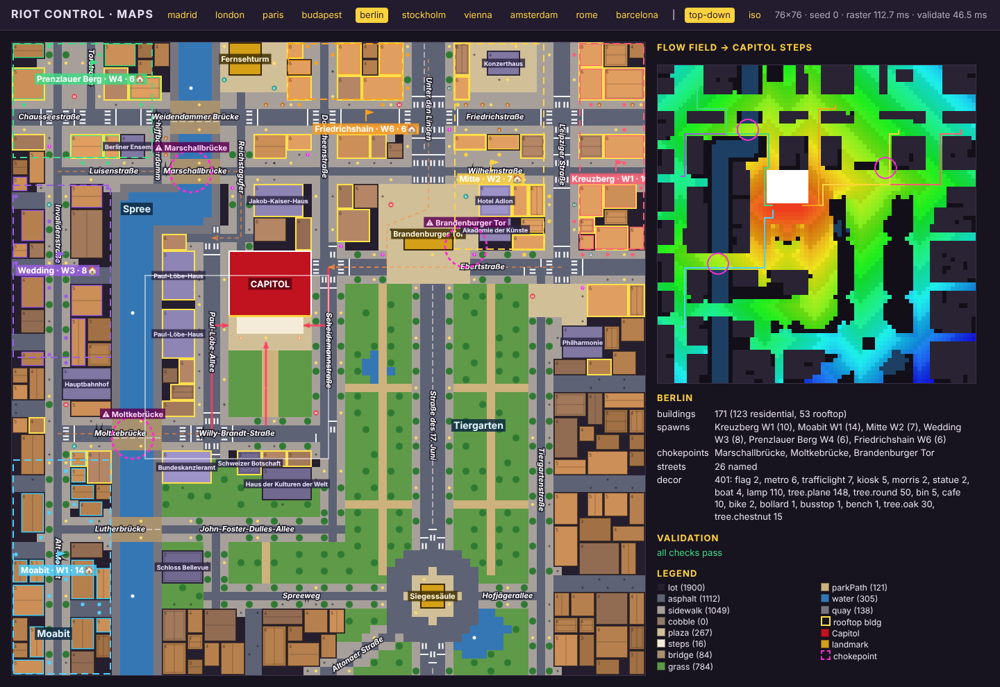
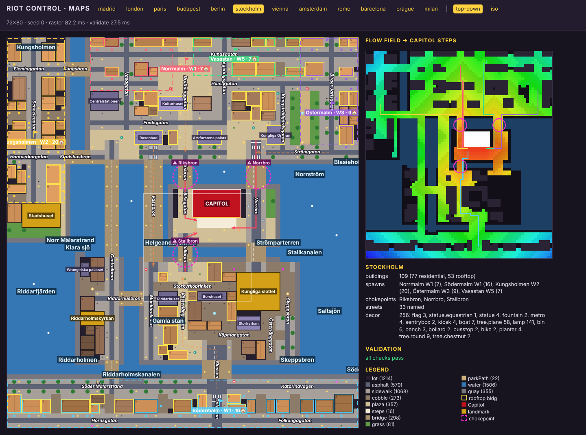
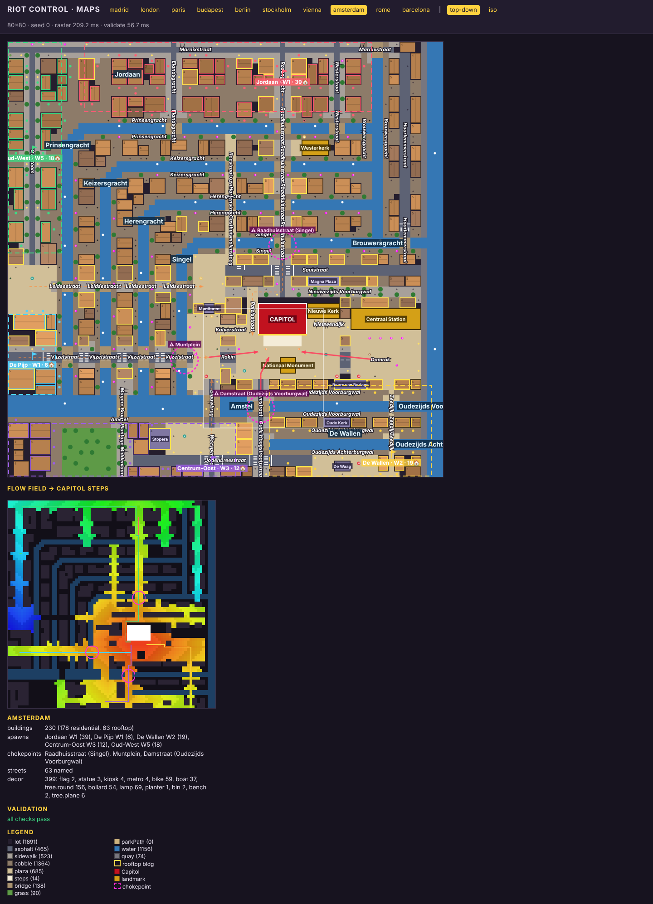

# E2 North — Berlin, Stockholm, Amsterdam blueprints

Three new city maps in the M2 format (docs/M2.md, src/maps/blueprint.ts), registered in
`src/maps/cities/index.ts` so all three are playable (with Madrid stand-in art until E3/E4/E5
land). All three pass every validator for seeds 0–12, and every spawn district reaches the
Capitol steps.

| City      | Size  | Capitol (contract)         | Landmarks placed                                                 | Buildings / rooftop | Districts |
| --------- | ----- | -------------------------- | ---------------------------------------------------------------- | ------------------- | --------- |
| Berlin    | 76×76 | Reichstag 10×8 at (26, 25) | Brandenburger Tor, Siegessäule, Fernsehturm                      | 171 / 53            | 6         |
| Stockholm | 72×80 | Riksdagshuset 10×6 at (38, 31) | Kungliga slottet, Stadshuset, Riddarholmskyrkan              | 103 / 54            | 5         |
| Amsterdam | 80×80 | Koninklijk Paleis 9×6 at (46, 48) | Nationaal Monument, Nieuwe Kerk, Centraal Station, Westerkerk | 230 / 63         | 5         |

All three keep the M2 convention: the Capitol's front and steps face +j, toward the player
(bottom-left of the screen in iso). Geography is drawn from memory, condensed about 2–3× around
the Capitol, with topology preserved and no mirroring.

## Berlin — Reichstag

**Rotation.** As for Madrid and London, real north is −i (left) and east is −j (up). The
Reichstag's west portal ("Dem Deutschen Volke") faces +j onto the Platz der Republik.

**Barriers.**
- **The Spree.** It comes in from the east (top) along Schiffbauerdamm and Reichstagufer. Just
  past the Reichstag's north-east corner it turns north (the Spreebogen, a left turn here). It
  then flows west (down) past the Paul-Löbe-Haus, the Chancellery, the Hauptbahnhof and Schloss
  Bellevue. Moabit, Wedding and Prenzlauer Berg lie across it.
- **The Tiergarten.** It fills the west and south-west (bottom and bottom-right): grass, which is
  walkable but slow, with paths, the Neuer See and the Großer Stern.

**Streets.**
- **Behind the Reichstag (east, top):** Dorotheenstraße, Wilhelmstraße and Friedrichstraße.
  Unter den Linden (6 wide, lime trees) runs from Pariser Platz up to the top edge. Gendarmenmarkt
  (Konzerthaus) sits there, and the Fernsehturm stands on Alexanderplatz at the far east edge.
- **South (right):** Ebertstraße runs past the Gate to Potsdamer Platz, with Leipziger Straße and
  Tiergartenstraße (Philharmonie).
- **West (bottom):** Straße des 17. Juni runs through the Tiergarten to the Siegessäule on the
  Großer Stern, with Spreeweg, Hofjägerallee, Altonaer Straße and John-Foster-Dulles-Allee
  (Haus der Kulturen der Welt).
- **Around the Reichstag:** Scheidemannstraße (south side), Paul-Löbe-Allee (north side, between
  the Platz and the Paul-Löbe-Haus) and Willy-Brandt-Straße (Chancellery). The Chancellery sits
  in the Spreebogen, north-west of the Platz, with the river behind it.
- **North bank:** Luisenstraße, Chausseestraße, Torstraße, Invalidenstraße and Alt-Moabit.

**Bridges.** Weidendammer Brücke (Friedrichstraße), Marschallbrücke (Wilhelmstraße →
Luisenstraße), Moltkebrücke (Willy-Brandt-Straße → Hauptbahnhof) and Lutherbrücke.

**Chokepoints.**
- **Marschallbrücke:** Wedding and Prenzlauer Berg cross here.
- **Moltkebrücke:** Moabit crosses here.
- **Brandenburger Tor:** the Gate is blocking, so crowds coming down Unter den Linden squeeze
  round its two ends on Pariser Platz. The flanks are kept solid with `noLanes`.

**Final approaches into the Platz der Republik.**
- Scheidemannstraße, from the Ebertstraße / Dorotheenstraße junction.
- Paul-Löbe-Allee, from Reichstagufer or the Moltkebrücke.
- Straight across the lawn from Willy-Brandt-Straße.

Crowds from Mitte arrive behind the Reichstag and must walk round it, as at the Palais Bourbon.

**Kill zones.** Pariser Platz, the Platz der Republik forecourt and Potsdamer Platz.

| Wave | District        | Edge / route                                                             |
| ---- | --------------- | ------------------------------------------------------------------------ |
| 1    | Kreuzberg       | right edge (south) → Wilhelmstraße / Ebertstraße → Scheidemannstraße     |
| 1    | Moabit          | bottom-left across the Spree → Moltkebrücke → Willy-Brandt-Straße        |
| 2    | Mitte           | Friedrichstadt (top right) → Pariser Platz → round the Gate              |
| 3    | Wedding         | left edge across the Spree → Luisenstraße → Marschallbrücke / Moltkebrücke |
| 4    | Prenzlauer Berg | top-left → Torstraße → Weidendammer / Marschallbrücke → Reichstagufer    |
| 6    | Friedrichshain  | top edge by Alexanderplatz → Dorotheenstraße, behind the Reichstag       |

**Decor and props.**
- Ampelmännchen traffic lights (`trafficlight`) at the Gate, Linden and Potsdamer Platz.
- U-Bahn signs (`metro`) at Bundestag, Brandenburger Tor, Friedrichstraße, Potsdamer Platz and
  Hauptbahnhof.
- Litfaßsäulen (`morris`), döner and Späti kiosks, bikes, flags on the forecourt, and Spree tour
  boats.

The Holocaust memorial site south of the Gate is deliberately left as ordinary city blocks.

## Stockholm — Riksdagshuset

**Rotation.** Unrotated: north is up. The Riksdag fills Helgeandsholmen. Its front faces south
across the Stallkanalen to Mynttorget, the square where Stockholm demonstrates, with the Royal
Palace beyond. The Norrström lies behind it (top).

**Islands and water.** The map is mostly islands; every crowd crosses water.
- **Norrmalm (top):** Strömgatan, Fredsgatan, Drottninggatan (pedestrian), Hamngatan, Kungsgatan,
  Vasagatan, Regeringsgatan, Birger Jarlsgatan and Kungsträdgårdsgatan. Rosenbad, Arvfurstens
  palats, the Opera and Kulturhuset are here, along with Gustav Adolfs torg, Sergels torg,
  Tegelbacken and Kungsträdgården.
- **Kungsholmen (left, across Klara sjö):** Hantverkargatan, Fleminggatan, Scheelegatan and
  Stadshuset on its south-east tip.
- **Helgeandsholmen:** the Riksdag, Riksgatan and Riksplan.
- **Gamla stan:** Mynttorget, Västerlånggatan, Munkbroleden, Storkyrkobrinken, Köpmangatan,
  Österlånggatan and Skeppsbron. Also Stortorget (Börshuset), Storkyrkan, Lejonbacken,
  Slottsbacken and Järntorget. Kungliga slottet stands on the north-east of the island.
- **Riddarholmen (south-west):** the church spire.
- **Södermalm (bottom, across the Söderström):** Söder Mälarstrand, Katarinavägen, Götgatan,
  Hornsgatan and Folkungagatan.
- **Open water:** Riddarfjärden opens to the west and Strömmen / Saltsjön to the east.

**Bridges.**
- Riksbron and Norrbro cross from Norrmalm.
- Stallbron leads to Mynttorget.
- Vasabron and Centralbron link Norrmalm to Gamla stan and Riddarholmen. Centralbron runs on over
  Riddarholmen and the Söderström to Södermalm.
- Riddarhusbron links Riddarholmen and Gamla stan.
- Stadshusbron and Kungsbron cross Klara sjö from Kungsholmen.
- Slussen (6 wide) links Gamla stan and Södermalm.

**Bridges are the identity.** Helgeandsholmen can be entered only over three bridges, and these
are its three final approaches:

- **Riksbron → Riksgatan:** from Drottninggatan, landing beside the Riksdag's west end.
- **Norrbro:** from Gustav Adolfs torg, landing on the island's east end, then on to the palace.
- **Stallbron:** from Mynttorget, landing straight in the forecourt.

They are also the three chokepoints (3 to 4 wide). Blocking any one leaves the other two, so
every district stays connected (checked by the redundancy validator).

Drottninggatan → Riksbron → Riksgatan → Stallbron → Mynttorget → Västerlånggatan is one
straight north–south axis, as in reality.

| Wave | District    | Edge / route                                                                   |
| ---- | ----------- | ------------------------------------------------------------------------------ |
| 1    | Norrmalm    | top-left of centre → Drottninggatan → Riksbron                                 |
| 1    | Södermalm   | bottom edge → Slussen (or Centralbron) → Järntorget → Västerlånggatan → Stallbron |
| 2    | Kungsholmen | left edge → Stadshusbron / Kungsbron → Tegelbacken → Vasabron or Riksbron       |
| 3    | Östermalm   | top-right → Hamngatan / Strömgatan → Gustav Adolfs torg → Norrbro              |
| 5    | Vasastan    | top edge → Kungsgatan → Drottninggatan / Regeringsgatan                        |

**Decor and props.**
- Flags on Riksplan and at the Opera, Gustav II Adolf (equestrian), Karl XII in Kungsträdgården,
  the Sergels torg obelisk, the palace obelisk and Birger Jarl.
- The Stortorget well, palace sentry boxes, T-bana signs, hot-dog kiosks, and ferries on
  Strömmen, Saltsjön and Riddarfjärden.

**Quays.** Quays along the open water are zero-width "rivers" that paint only the embankment
(see Notes).

## Amsterdam — Koninklijk Paleis

**Rotation.** Real north is +i (right) and east is +j (down). The palace's long east front faces
+j onto the Dam, with the Nationaal Monument opposite and the Nieuwe Kerk beside it to the north.

**Streets.**
- **North (right):** Damrak (5 wide) runs to Stationsplein and Centraal Station on the IJ (right
  edge). Nieuwendijk runs parallel.
- **South (left):** Rokin and Kalverstraat run to Muntplein (Munttoren).
- **Behind the palace (west, up):** Paleisstraat, Nieuwezijds Voorburgwal (Magna Plaza),
  Spuistraat and the Spui.

**The canal belt.**
- **Shape.** Singel, Herengracht, Keizersgracht and Prinsengracht are four concentric ⌐-shapes.
  Their western reaches run across the top, bend 45° at the south-west, and their southern
  reaches run down the left side into the Amstel.
- **Spacing.** The canals are 2 tiles of water, 7 tiles apart.
- **Quays.** Each canal has a 1-tile brick quay street on both banks, with elms, bikes, bollards
  (Amsterdammertjes) and moored houseboats. The houses between canals are narrow (≤ 3 tiles) and
  tall, with gables.
- **Closing the ring.** The Brouwersgracht closes the ring in the north-west; the Singel runs on
  to the IJ.

**Crossing streets.** Raadhuisstraat / Rozengracht leads to the Westerkerk on the Prinsengracht
(Westermarkt). Gasthuismolensteeg / Hartenstraat / Reestraat (the Nine Streets), Leidsestraat
(→ Leidseplein), Vijzelstraat (→ De Pijp), Westerstraat and Elandsgracht also cross the belt,
with Marnixstraat and Overtoom beyond. Each canal crossing is its own bridge.

**East and south-east.**
- **De Wallen:** east of Damrak, with Damstraat / Oude Hoogstraat crossing the Oudezijds
  Voorburgwal and Achterburgwal canals, the Zeedijk, the Oude Kerk and the Beurs van Berlage.
- **Centrum-Oost:** across the Amstel (Blauwbrug, Magere Brug), with Waterlooplein (Stopera),
  Weesperstraat, Plantage Middenlaan, Jodenbreestraat and Nieuwmarkt (De Waag).

**Chokepoints.**
- **Raadhuisstraat × Singel:** the Jordaan crowd.
- **Muntplein:** Vijzelstraat over the Singel, for De Pijp.
- **Damstraat × Oudezijds Voorburgwal:** Centrum-Oost and De Wallen.

**Final approaches into the Dam.** Damrak (north), Rokin (south) and Damstraat (east). The Dam
is the kill zone in front of the steps.

| Wave | District     | Edge / route                                                                 |
| ---- | ------------ | ---------------------------------------------------------------------------- |
| 1    | Jordaan      | top edge → Rozengracht → four Raadhuisstraat bridges → Paleisstraat          |
| 1    | De Pijp      | left edge → Vijzelstraat over four canals → Muntplein → Rokin                |
| 2    | De Wallen    | bottom-right → Zeedijk → Stationsplein → Damrak                              |
| 3    | Centrum-Oost | bottom-left across the Amstel → Jodenbreestraat → Damstraat bridges          |
| 5    | Oud-West     | top-left beyond Prinsengracht → Overtoom → Leidseplein → Leidsestraat → Spui |

**Noord.** Noord is not on the map. With the station's 13×4 footprint fixed along i, the IJ is
only a 3-tile strip at the right edge and there is no room for a shore beyond it. Ferries are out
of scope, so Noord could not reach the Dam anyway.

**Centraal Station.** The contract footprint runs along i, but in this rotation the IJ shore runs
along j. The station therefore lies along the IJ-side end of Damrak, with its +j front on
Stationsplein, rather than parallel to the water.

## Playtests (10 min, `--bots balanced --seeds 1`)

See the report section at the end of this file.

## Notes and limitations

- **Quay lines.** Stockholm uses `width: 0` rivers to paint embankment quays along `water` areas.
  Rivers paint only `quay` where `water` is absent, so a zero-width river is a 1-tile quay line.
  The viewer labels them, so they carry real quay names (Norr Mälarstrand, Skeppsbron …).
- **Canal quays.** Amsterdam uses `quay: 0` canals with 1-tile quay streets on both banks instead
  of blocked embankments.
- **Costed flow-field bug (reported, not changed).** In `src/maps/flow.ts`, `distanceField`
  stores distances as Float32 but compares the Float64 heap key with `d > dist[k]`. A tile whose
  costed distance rounds *down* in float32 is therefore never expanded. Typical cases are
  non-integer costs such as cobble 1.1, grass 1.6 and parkPath 1.2.
  - **Effect on validators and the viewer.** The costed field has holes (Madrid 540, London 242,
    Paris 149 tiles at seed 0), so viewer routes and the `choke.flow` validator stop short on
    cobble.
  - **The fix.** `const nd = Math.fround(d + …)` removes every hole.
  - **Why it isn't applied.** With the fix, Paris's `choke.flow` check fails twice: two of its
    chokepoints are "on a route" only because of the bug. So the fix needs an orchestrator
    decision together with a Paris chokepoint tweak.
  - **Workaround here.** Main routes avoid cobble: Riksgatan, Västerlånggatan, Mynttorget,
    Järntorget, Kalverstraat, Paleisstraat and Nieuwendijk use `plaza` paving. Cobble stays on
    side streets and quays.
- **Landmark-count test.** `places only its own city landmarks` required ≥ 4 landmarks, but
  Berlin, Stockholm and Vienna have only 3 contract landmarks. The test now requires
  `min(4, contract landmarks of the city)`.
