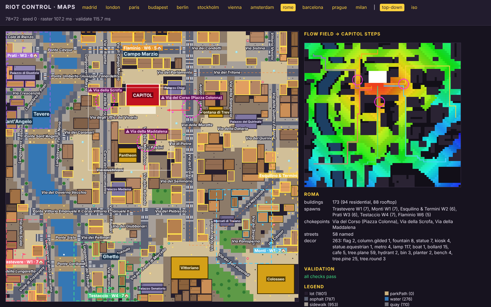
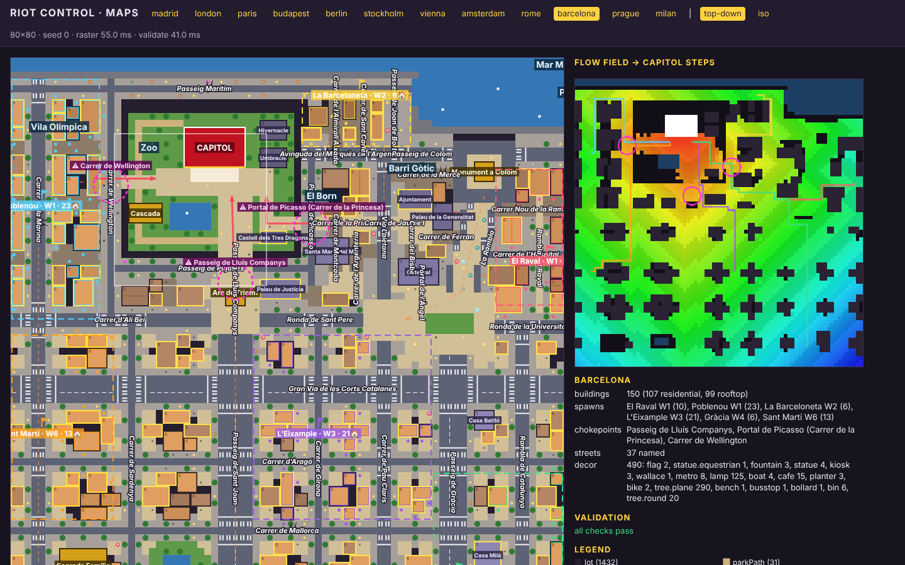
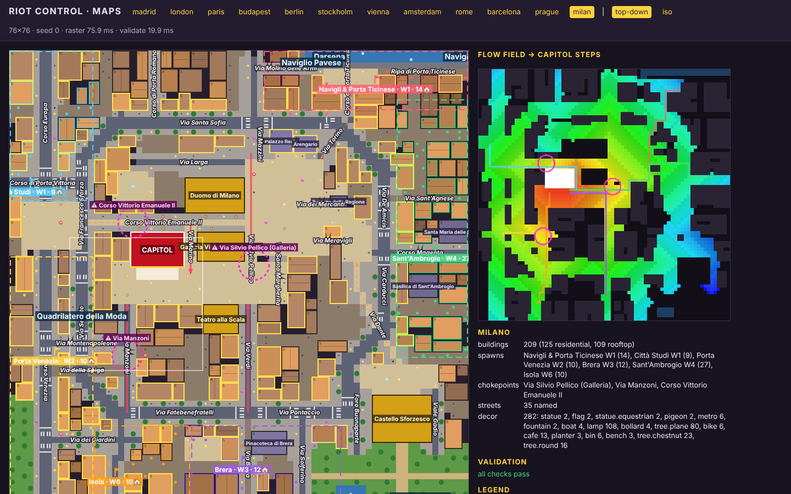
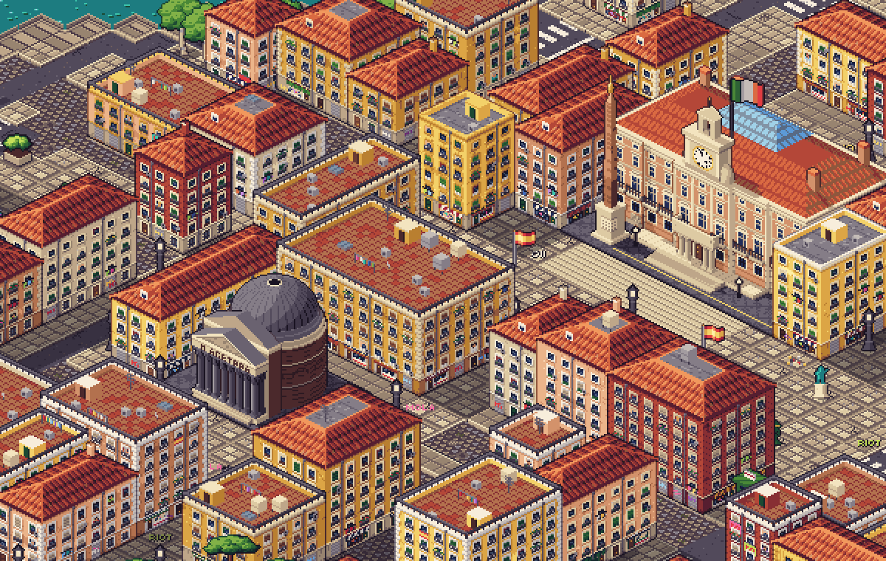
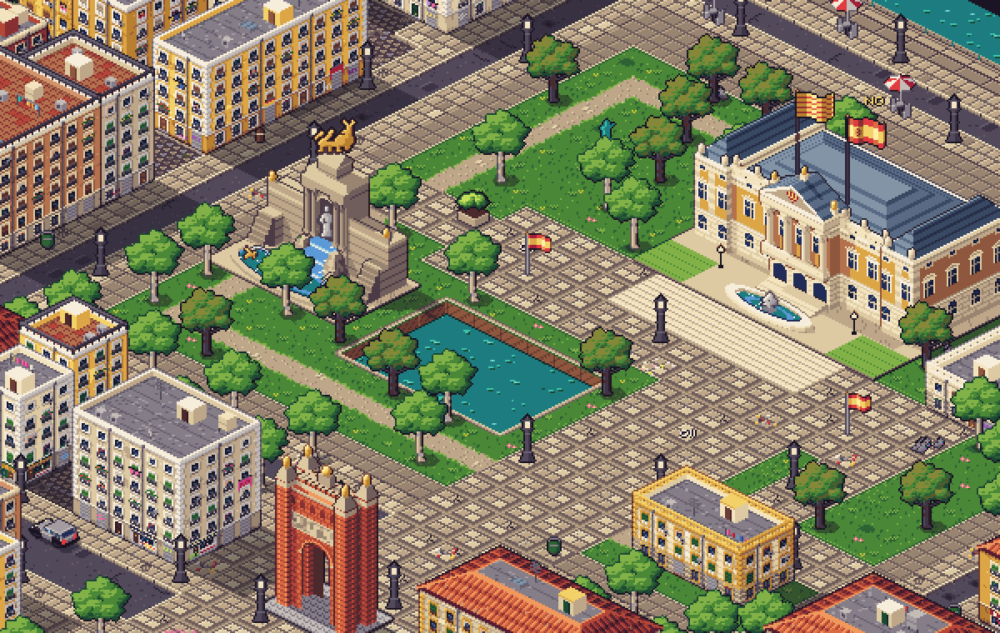
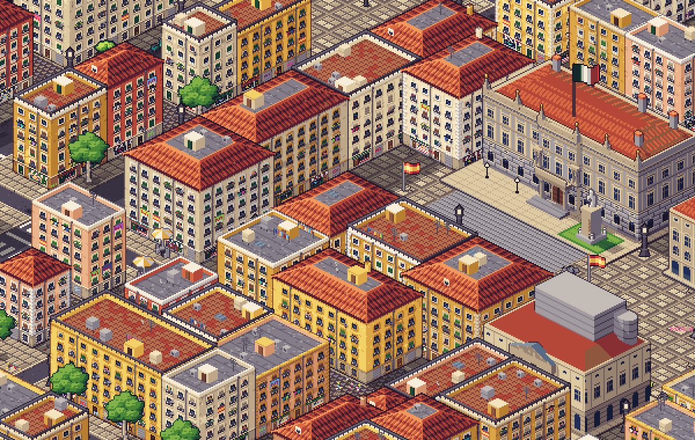

# E2 South — Rome, Barcelona, Milan blueprints

Three hand-authored blueprints in the M2 format (docs/M2.md, src/maps/blueprint.ts), registered in
`src/maps/cities/index.ts` (one line each) and checked by `tests/maps-blueprints.test.ts`
(validators, connectivity, determinism, 12-seed sweep, `REQUIRED_STREETS`).

In game, at the default camera (zoom 2), with E4's Capitols and landmarks and the stand-in
building art:

| City      | Size  | Capitol (contract)         | Landmarks placed                                    | Buildings (seed 0) |
| --------- | ----- | -------------------------- | --------------------------------------------------- | ------------------ |
| Rome      | 78×72 | Montecitorio 9×6 @ 32,14   | pantheon, trevi, vittoriano, colosseum (edge)       | 173 (88 rooftop)   |
| Barcelona | 80×80 | Parlament 9×6 @ 25,10      | cascada, arcTriomf, columbus, sagradaFamilia (edge) | 150 (99 rooftop)   |
| Milan     | 76×76 | Palazzo Marino 9×6 @ 20,30 | duomo, galleria, laScala, castello (edge)           | 209 (109 rooftop)  |

Geography is redrawn from memory (OSM blocked) and condensed ~2–3× around the Capitol, like the
original three. Each map is a pure rotation of the real city (never mirrored), chosen so that the
Capitol's real front faces +j and the big landmarks show their main façade to the camera where
possible (see _Notes for E4_).

## Rome — Palazzo Montecitorio

**Orientation:** unrotated, north up. Bernini's façade really faces south onto Piazza di
Montecitorio, so the +j front is the true front.

- **Around the Capitol:** Piazza di Montecitorio (the obelisk is drawn by the Capitol art) is the
  forecourt. Piazza Colonna opens east of it onto Via del Corso, with the Column of Marcus Aurelius
  and Palazzo Chigi on its north side; Piazza del Parlamento is behind. The Pantheon is south-west
  with Piazza della Rotonda in front of its portico. The Trevi Fountain is east across the Corso,
  in its tiny piazza reached by Via delle Muratte, Via del Lavatore and Via della Stamperia.
  Piazza Navona (three fountains), Campo de' Fiori and Largo di Torre Argentina complete the
  centro.
- **South:** the Corso runs straight to Piazza Venezia and the **Vittoriano**, with the
  Campidoglio (Marcus Aurelius on horseback) beside it. Via dei Fori Imperiali runs between the
  Foro di Traiano and the Foro Romano (lawns, umbrella pines) to the **Colosseum**, the edge
  landmark in the bottom-right corner.
- **Barrier:** the Tiber on the left, with plane-tree Lungoteveri on both banks. It bends east at
  the top (Ponte Cavour, Ponte Umberto I, Prati and the Palazzo di Giustizia across), swings west
  round Castel Sant'Angelo (Ponte Sant'Angelo with Bernini's angels), then comes back east past
  Ponte Vittorio Emanuele II, Ponte Sisto and Ponte Garibaldi, with Trastevere across.
- **Streets:**
  - Via del Corso, Via del Tritone (up to Piazza Barberini), Via Tomacelli → Via dei Condotti →
    Piazza di Spagna, Via Sistina, Via Vittorio Veneto.
  - Via di Ripetta → Via della Scrofa → Corso del Rinascimento, Via Giuseppe Zanardelli.
  - Corso Vittorio Emanuele II + Via del Plebiscito, Via Arenula, Via del Teatro di Marcello,
    Via Marmorata.
  - Via Nazionale (to Piazza della Repubblica), Via IV Novembre, Via Cavour, Via del Quirinale
    (Palazzo del Quirinale), Via delle Quattro Fontane.
  - In Prati and Trastevere: Via Crescenzio, Via Cola di Rienzo, Viale di Trastevere.
  - Lungotevere Marzio, Tor di Nona, dei Tebaldi, Prati, Castello and della Farnesina.
- **Centro storico character:** narrow cobbled vicoli with dog-legs (Via dei Coronari, Via del
  Governo Vecchio, Via dei Pastini, Via del Seminario, Via dei Giubbonari, Via dei Serpenti,
  Via Panisperna, Via della Lungaretta, Via della Scala). Auto-lanes are cobbled, the block size
  is small (`maxBlock` 11) and buildings are short (≤ 4 tiles of frontage), so it reads as a dense
  warren of small piazzas.
- **Final approaches** into Piazza di Montecitorio:
  - Piazza Colonna (from Via del Corso, east);
  - Via della Maddalena (from the Pantheon, south — a straight paved alley on through Via della
    Rotonda to Corso Vittorio);
  - Via degli Uffici del Vicario (from Via della Scrofa, west).
- **Chokepoints:**
  - Via del Corso at Piazza Colonna: Monti, Esquilino and Flaminio crowds;
  - Via della Scrofa: Prati over Ponte Umberto I, and Flaminio;
  - Via della Maddalena: Testaccio and Trastevere via Via della Rotonda.

| District            | Wave | Where                                                                                |
| ------------------- | ---- | ------------------------------------------------------------------------------------ |
| Trastevere          | 1    | across the Tiber, bottom-left (Ponte Sisto / Garibaldi)                              |
| Monti               | 1    | east of the Fori, between Via Nazionale and Via Cavour                               |
| Esquilino & Termini | 2    | right edge round Piazza della Repubblica                                             |
| Prati               | 3    | across the Tiber, top-left (Ponte Cavour / Umberto I)                                |
| Testaccio           | 4    | bottom edge, south of the Ghetto (Via Marmorata)                                     |
| Flaminio            | 6    | top edge, Via di Ripetta / Via del Corso from Piazza del Popolo — behind the Capitol |

## Barcelona — Parlament de Catalunya

**Orientation:** aligned with the Eixample grid, the way barcelonins give directions. Mar (the sea,
real SE) is −j (top), muntanya (real NW) is +j (bottom), Besòs is left and Llobregat is right.
It is a pure rotation.

- **Around the Capitol:** the Parlament stands in the fenced **Parc de la Ciutadella** (railings
  = reserved lot, as in Madrid's Retiro). Its front faces the park, toward Plaça del Parlament (the
  Desconsol pond is in the Capitol art). The **Cascada** and the lake are in front of it to the
  left. Inside the park are the Hivernacle, the Umbracle and the Castell dels Tres Dragons;
  "General Prim" stands by the zoo.
- **Gates:** three, with paved avenues into the forecourt. Pujades leads out to Passeig de Lluís
  Companys and the **Arc de Triomf**, Picasso to El Born, and Wellington to the Vila Olímpica.
- **Barriers:** the Mediterranean along the top and **Port Vell** at top-right, plus the park
  railings.
- **Ciutat Vella** (right of the park):
  - El Born: Carrer de la Princesa, Carrer de Montcada, Santa Maria del Mar, Passeig del Born.
  - Via Laietana.
  - Barri Gòtic: Carrer de Jaume I, Plaça de Sant Jaume between the Generalitat and the
    Ajuntament, Carrer del Bisbe, the Catedral and Pla de la Seu, Portal de l'Àngel, Carrer de
    Ferran, Plaça Reial, Carrer de la Mercè.
  - **La Rambla**, with its tree-lined central promenade, kiosks and the Liceu metro, from the
    **Columbus monument** (roundabout of Plaça del Portal de la Pau on Passeig de Colom, SW edge)
    up to Plaça de Catalunya.
  - El Raval beyond: Carrer de l'Hospital, Carrer Nou de la Rambla, Rambla del Raval (Botero's
    cat).
- **Barceloneta:** at the top between the sea and the port, with Passeig Marítim, Passeig de
  Joan de Borbó, Carrer de l'Almirall Aixada and Carrer de Sant Carles.
- **Eixample grid** (bottom half):
  - Rows: Carrer d'Ali Bei / Ronda de Sant Pere, **Gran Via de les Corts Catalanes**, Carrer
    d'Aragó, Carrer de Mallorca, Carrer de Provença.
  - Columns: **Carrer de la Marina**, Carrer de Sardenya, Passeig de Sant Joan, Carrer de Girona,
    Pau Claris (continuing **Via Laietana**), **Passeig de Gràcia** (Casa Batlló, Casa Milà),
    Rambla de Catalunya.
  - **Chamfered corners (xamfrans):** every block corner at every Eixample crossing is cut by a
    3-tile diagonal staircase of plaza paving (`chamfers()` in barcelona.ts), so each crossing
    opens into a small octagonal plaza. The old-town edge (Ali Bei / Ronda) is chamfered only on
    its Eixample side.
  - The **Sagrada Família** is the edge landmark on Carrer de Mallorca between Marina and
    Sardenya, with Plaça de la Sagrada Família (pond) beside it.
  - Avinguda Diagonal does not fit (it is ~1 km beyond Mallorca at this scale).
- **Final approaches:**
  - Portal de Pujades, from Lluís Companys;
  - Portal de Picasso, from Carrer de la Princesa / Passeig de Picasso;
  - Portal de Wellington.
- **Chokepoints:**
  - Passeig de Lluís Companys, under the Arc de Triomf: Eixample;
  - Portal de Picasso (Carrer de la Princesa): Raval, Barceloneta and Gràcia;
  - Carrer de Wellington: Poblenou and Sant Martí.

| District       | Wave | Where                                                     |
| -------------- | ---- | --------------------------------------------------------- |
| El Raval       | 1    | right edge, beyond La Rambla                              |
| Poblenou       | 1    | left edge by the sea (Vila Olímpica, Carrer de la Marina) |
| La Barceloneta | 2    | top, between the beach and Port Vell                      |
| L'Eixample     | 3    | centre-bottom (Dreta de l'Eixample, Girona / Pau Claris)  |
| Gràcia         | 4    | bottom-right, up Passeig de Gràcia                        |
| Sant Martí     | 6    | left edge, Marina / Gran Via (toward Glòries)             |

## Milan — Palazzo Marino (Comune) on Piazza della Scala

**Orientation:** rotated 180°, so north is +j (down) and east is left. Only this rotation lets
the Duomo's west façade face the camera (+i) across its piazza and puts Palazzo Marino's real
front on Piazza della Scala on +j.

- **Around the Capitol** (laid out to match E4's art, where both the Duomo façade and the
  Galleria's triumphal arch are drawn on +u):
  - The **Duomo**'s west façade faces +i onto **Piazza del Duomo** (Vittorio Emanuele II on
    horseback, Palazzo Reale and the Arengario at its top).
  - The **Galleria Vittorio Emanuele II** sits below the Duomo, across the pedestrian Corso
    Vittorio Emanuele II. Its arch (+u) opens onto the lower part of Piazza del Duomo, and its
    cross arm (+v) onto **Piazza della Scala**.
  - **Palazzo Marino** is left of the Galleria, i.e. truly east of it, with Via Marino between
    them. Its front faces +j onto Piazza della Scala (Leonardo's monument), with the **Teatro
    alla Scala** across the piazza.
  - Also: Piazza dei Mercanti (Palazzo della Ragione), Cordusio and Piazza Fontana.
- **Streets:**
  - **Via Manzoni**, **Via Montenapoleone**, Via della Spiga (the Quadrilatero).
  - **Corso Vittorio Emanuele II** (pedestrian, Duomo → San Babila), Corso Venezia, Corso
    Europa, Corso di Porta Vittoria, Corso di Porta Romana.
  - **Via Torino** → Corso di Porta Ticinese.
  - **Via Dante** (pedestrian, Cordusio → Largo Cairoli → **Castello Sforzesco**) and
    **Corso Magenta** (Santa Maria delle Grazie, Sant'Ambrogio).
  - Via Verdi → Via Brera (Pinacoteca), Via Solferino, Via Larga, Via Mazzini, Via Meravigli,
    Via Sant'Agnese.
- **Ring:** the **Cerchia dei Navigli** encloses the centro as a chamfered octagon. Its sides are
  Via Santa Sofia, Via De Amicis, Via Carducci, Via Pontaccio, Via Fatebenefratelli, Via Senato
  and Via Francesco Sforza. **Navigli:** the Naviglio Grande / Darsena run along the top
  edge, with Ripa di Porta Ticinese, Piazza XXIV Maggio and Via Molino delle Armi.
- **Barrier:** **Parco Sempione** behind the Castello in the bottom-right corner (lawns, the
  laghetto, the Arco della Pace), plus the Navigli along the top.
- **Galleria (format limitation):** landmarks are `blocking: true` and their tiles must be `lot`
  (contract + validator), so the Galleria cannot be a walkable covered passage. It is a blocking
  landmark (E4 draws it solid, with dark arch openings), and the march Duomo → Scala goes round
  it on both sides: **Via Silvio Pellico**, the short paved link from the arch end of Piazza del
  Duomo down to Piazza della Scala, and **Via Marino**, between the Galleria and the palazzo off
  Corso Vittorio Emanuele II. Both are final approaches. Via Santa Margherita runs parallel, one
  block further right.
- **Final approaches:** Via Silvio Pellico, Via Marino, Via Manzoni and Via Verdi.
- **Chokepoints:**
  - Via Silvio Pellico (Galleria): Navigli, Sant'Ambrogio and (via Via Verdi) Brera crowds
    coming over Piazza del Duomo;
  - Via Manzoni: Porta Venezia and Isola;
  - Corso Vittorio Emanuele II: Città Studi via San Babila.

| District                 | Wave | Where                                          |
| ------------------------ | ---- | ---------------------------------------------- |
| Navigli & Porta Ticinese | 1    | top edge along the Naviglio / Darsena          |
| Città Studi              | 1    | left edge (east), Corso di Porta Vittoria      |
| Porta Venezia            | 2    | left edge, Corso Venezia / Giardini Montanelli |
| Brera                    | 3    | bottom, Via Brera / Solferino                  |
| Sant'Ambrogio            | 4    | right edge, Corso Magenta                      |
| Isola                    | 6    | bottom edge, Via Manzoni toward Porta Nuova    |

## Decor kinds used

All three cities place only kinds that resolve today, directly or through `PROP_FALLBACK`:

- `tree.plane`, `tree.pine` (Rome's umbrella pines), `tree.round`, `tree.chestnut`;
- `lamp`, `bench`, `bin`, `bollard`, `hydrant`, `kiosk`, `busstop`, `planter`, `bike`, `cafe`;
- `metro`, `flag`, `statue`, `statue.equestrian`, `fountain`, `wallace`, `column.gilded`;
- `boat`, `pigeon`.

The Column of Marcus Aurelius is placed as `column.gilded` (→ statue). The Rambla's Canaletes
fountain is `wallace`.

E3 can give any of these city art through `props.extra`. Nice-to-haves that would need a new
decor kind plus E3 art: a `tree.palm` for Barcelona's seafront and Plaça Reial, and a Roman
`nasone` drinking fountain.

## Notes for E4 (landmark art) — which way things face

- **Rome**
  - The Pantheon's piazza is on its +j side, so the portico can face the camera.
  - The Trevi faces +j onto its piazza (true).
  - The Vittoriano is the one unavoidable mismatch. It sits south of Piazza Venezia at the end
    of the Corso, so its real front faces −j (north). E4 draws the front on +v, which looks onto
    the Campidoglio / Via del Teatro di Marcello side. Fixing that would mean rotating Rome 180°,
    which would turn Montecitorio's true front away from the camera.
  - The Colosseum is in the corner, surrounded by its piazza.
- **Barcelona**
  - The Arc de Triomf straddles Lluís Companys, which runs along j. The promenade passes either
    side of the 3-wide arch, and its opening is along j.
  - Columbus stands in the Portal de la Pau roundabout, with the Rambla leaving at +j.
  - The Cascada faces +j toward the Pujades side of the park.
  - The Sagrada Família's +j face is Carrer de Provença and its −j face is Carrer de Mallorca (the
    Glòria façade). Marina is at its −i side, the Nativity façade, and Sardenya at +i, the Passion
    façade.
- **Milan**
  - The Duomo's west façade faces +i onto Piazza del Duomo.
  - The Galleria's arch (+u) faces the lower part of Piazza del Duomo (+i side) and its cross
    arm (+v) faces Piazza della Scala. This matches E4's art.
  - La Scala sits across the piazza from Palazzo Marino, so its real front faces −j, toward the
    piazza. Facing buildings cannot both show their +v front.
  - The Castello's Filarete tower faces −j, toward Largo Cairoli and Via Dante, with Parco
    Sempione at +j.

## Verification

- Validators: no errors on seeds 0–12 for all three cities. Every spawn door and rally reaches
  the steps, every road tile is connected, the final approaches are redundant, and every
  chokepoint lies on at least one district's costed shortest route.
- Chokepoint routes were checked twice: against `validateMap` and against an exact (float64)
  Dijkstra, because of the flow-field issue below. Both agree on which chokepoint each district
  uses.
- `npx vitest run tests/maps-blueprints.test.ts`: 182 passed, 45 of them for Rome, Barcelona and
  Milan (after Milan's re-layout). ESLint, Prettier and `npm run typecheck` are clean.
- Playtest (`npm run playtest -- --cities <id> --bots balanced --seeds 1 --minutes 10`): see
  _Playtest_ below.

## Playtest

`node tools/playtest.mjs --cities rome,barcelona,milan --bots balanced --seeds 1 --minutes 10`
ran all three cities for 10 simulated minutes without errors. Madrid and Paris were run with the
same settings for comparison.

| City      | waves | peak crowd | spawned | min Capitol integrity | rams | climbs | ms/tick |
| --------- | ----- | ---------- | ------- | --------------------- | ---- | ------ | ------- |
| Rome      | 9     | 68         | 423     | 99 %                  | 13   | 9      | 1.37    |
| Barcelona | 9     | 63         | 420     | 100 %                 | 10   | 2      | 1.40    |
| Milan     | 8     | 55         | —       | 95 %                  | 23   | 0      | 0.53    |
| Madrid    | 9     | 67         | —       | 100 %                 | 5    | 0      | 0.97    |
| Paris     | 9     | 76         | —       | 69 %                  | 38   | 12     | 1.12    |

The machine was heavily loaded by parallel agents, so treat ms/tick as relative only. A re-run on
a lightly loaded machine gave the same waves, peaks, integrity, rams and climbs, at 0.10 (Rome),
0.09 (Barcelona) and 0.08 (Milan) ms/tick.

**Crowd flow:** each district's costed shortest route to the steps, from the exact field.

- **Rome:** the crowds funnel into three alleys.
  - Monti (69) and Esquilino (52) come up the Corso through Piazza Colonna. The bots' riot
    lines meet them at Largo Chigi.
  - Prati (47, over Ponte Umberto I) and Flaminio (35, down Via di Ripetta) take Via della Scrofa
    into Via degli Uffici del Vicario.
  - Testaccio (57) and Trastevere (68, over Ponte Sisto) come up through Campo de' Fiori. They
    split between Via della Rotonda → Via della Maddalena and Corso del Rinascimento →
    Uffici del Vicario (near-equal costs), so the Pantheon side stays busy.
  - The rooftops along the Corso and the centro carry the snipers (9 climbs: protesters scale
    the low palazzi).
- **Barcelona:** the park railings make the three gates the only ways in.
  - Poblenou (26) and Sant Martí (58) use Carrer de Wellington.
  - L'Eixample (48) marches down Passeig de Sant Joan, under the Arc de Triomf and along Lluís
    Companys.
  - El Raval (57), La Barceloneta (44) and Gràcia (90, via Passeig de Gràcia → Plaça de
    Catalunya → Ronda de Sant Pere → Passeig de Picasso) converge on the Portal de Picasso.
  - The long park avenues give defenders depth; the Capitol was never seriously threatened in
    10 minutes.
- **Milan:** four short final legs into a small piazza, after the re-layout to E4's Galleria
  orientation.
  - Porta Venezia (27) and Isola (37) come down Via Manzoni.
  - Città Studi (42) arrives along Corso Vittorio Emanuele II from San Babila and turns into Via
    Marino beside the palazzo.
  - Navigli (64, via Via Torino), Sant'Ambrogio (50, via Cordusio and Piazza dei Mercanti) and
    Brera (42, up Via Verdi) all meet at the Galleria's arch end. They squeeze down Via Silvio
    Pellico into Piazza della Scala, which is the hottest spot.
  - The crowd dented the palazzo slightly (95 %), and 23 rams show mobs pushing through the riot
    lines in the narrow links.

## Known issue found: `src/maps/flow.ts` costed fields drop cobbled tiles

`distanceField` stores distances in a `Float32Array` but keys the heap with the unrounded float64
`nd`. When a cost rounds **down** in float32, `if (d > dist[k]) continue` skips the tile, so its
neighbours are never expanded from it. Cobble (1.1), parkPath (1.2), grass (1.6) and steps (1.3)
all hit this. In practice, any area reachable only over cobble gets `Infinity` in the costed
field: the viewer heat map and `validateMap`'s `choke.flow` check. Madrid's La Latina rally is one
case. The sim uses its own flow fields, so gameplay is unaffected.

The one-line fix is `heap.push(dist[to]!, to)`. With it, **Paris fails `choke.flow`**: Pont de la
Concorde and Rue de Bourgogne are on no district's true shortest route, and only pass today
because of the bug. So the fix was not applied (not backwards compatible). The South cities are
designed to pass with and without it: the final alleys on chokepoint routes are paved `plaza`
rather than `cobble`, and every rally sits on asphalt or plaza.
