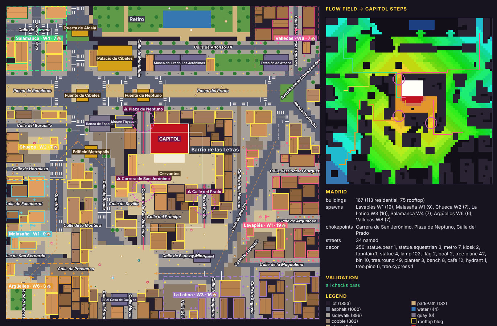
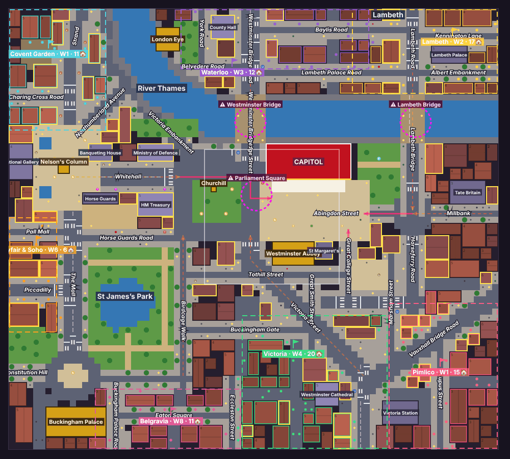
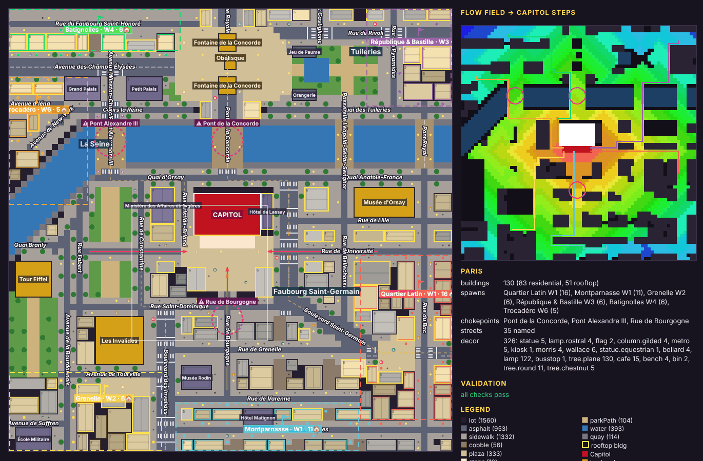
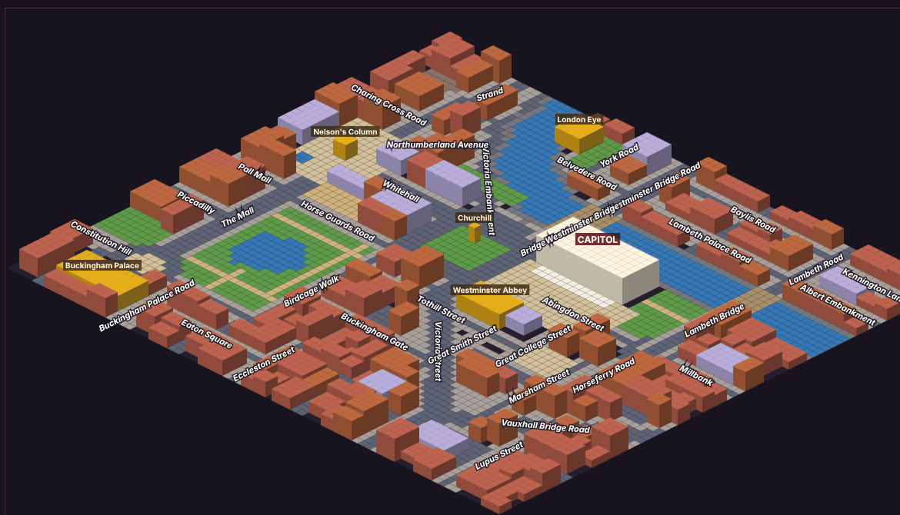

# M2 — City blueprints

Three hand-authored, stylised city maps (Madrid, London, Paris) as `MapData` (`src/maps/contract.ts`),
built from compact vector blueprints by a deterministic rasteriser, validated for gameplay, and
inspectable in a canvas debug viewer (`maps.html`).






## Files

| File | What |
|---|---|
| `src/maps/blueprint.ts` | Blueprint authoring format (types + `inShape`, `rect`, `circle`, `poly`). |
| `src/maps/rasterize.ts` | `rasterize(blueprint, seed)` → `MapData`. |
| `src/maps/validate.ts` | `validateMap(map, blueprint?)` → `Issue[]`, plus `tilesNearPath`, `spawnDoors`. |
| `src/maps/flow.ts` | `distanceField(map, targets, opts)` (Dijkstra, GROUND_COST, 4/8-conn., extra blocked mask), `descend(map, field, from)`. |
| `src/maps/index.ts` | Public API (re-exports the contract). |
| `src/maps/cities/{madrid,london,paris}.ts` | The three blueprints. |
| `src/mapviewer/main.ts`, `maps.html` | Debug viewer (also a Vite build input). |
| `tests/maps-blueprints.test.ts` | 47 tests (validators, connectivity, determinism, perf, 12-seed sweep). |

## API

```ts
import { loadMap, isWalkable, isPlaceableRoad, buildingAt, nearestWalkable, inBounds, tileIndex,
         groundAt, isCapitol, distanceField, descend, BLUEPRINTS, clearMapCache } from './maps';

const map = loadMap('madrid');          // cached per (city, seed); seed 0 = canonical
const map2 = loadMap('paris', 7);       // other seeds re-roll buildings/decor, never the layout
isWalkable(map, i, j);                  // WALKABLE grounds, bounds-checked
isPlaceableRoad(map, i, j);             // PLACEABLE_ROAD grounds (road units, blockades)
buildingAt(map, i, j);                  // BuildingData | undefined
nearestWalkable(map, i, j, maxR?);      // TilePos | null (Chebyshev rings)
const f = distanceField(map, map.capitol.steps);            // Float32Array, Infinity = unreachable
const route = descend(map, f, map.spawns[0].rally);          // steepest-descent tile path
```

Performance: rasterising takes **3–8 ms warm** per map (Node); validation ~10–20 ms. The test
suite asserts < 50 ms.

Notes for consumers:
- `MapData.streets[].path` points are **fractional tile coordinates** of the centre line
  (x.5 = tile centre). `width` is the full width incl. sidewalks. Bridges are included as streets.
- `MapData.landmarks` may contain the same id twice (Paris places two `concordeFountain`s).
- Buildings: footprints 2×2…6×4 (either orientation), storeys 2–6. Hand-placed **civic** buildings
  (ministries, museums, stations — `kind: 'civic'`) come first in `buildings`. Some interior
  back-buildings have `doors: []` (no street frontage). Doors prefer the camera-visible faces
  (+j, then +i) and sidewalk/plaza tiles; long buildings get 2 doors.
- `spawns[].buildingIds` are residential buildings with doors whose footprint centre lies in the
  district area; every district has ≥ 6 (guaranteed by a fix-up pass).
- Every approach in the blueprint has ≥ 3 rooftop buildings within 5 tiles (fix-up pass).
- `cameraStart` is 5–6 tiles in front of the middle of the steps.
- Unused contract grounds: London/Paris use `quay` along rivers; Madrid has none.

## Blueprint format (summary)

Tile coordinates `[i, j]`; tile (i, j) has its centre at (i+.5, j+.5). Roads cover every tile whose
centre is within width/2 of the centre line, so **odd widths are centred on x.5, even widths on
integers**. Polylines: flat caps at the ends, square joins between axis-aligned segments, round
joins on diagonal bends.

- `roads`: `{ name?, path, width, sidewalk?, surface?, cls?, trees?, rooftops?, cafes?, storeyBonus?, markings?, labelPath? }`.
  Class defaults by width (≥4 avenue, ≥2 street). Carriageway claims beat sidewalk claims; higher
  class beats lower, so crossings stay continuous.
- `areas`: ground shapes (`rect`/`circle`/`poly`) on the `base` layer (before roads: parks, lakes)
  or `top` layer (after roads: plazas, roundabouts, promenades). Optional scattered `trees` and
  `reserve` (blocked, never built — e.g. the Retiro railings).
- `rivers` (water + 1-tile `quay` embankments) and `bridges` (deck tiles become `bridge`).
- `landmarks` (contract ids/footprints), `capitol` (`CAPITOL_FOOTPRINT`, steps rows along +j),
  `civic` buildings, `zones` (storeys/residential/roof/footprint overrides).
- `districts` (spawn areas + rally + unlockWave), `chokepoints`, `approaches` (named polylines;
  `final: true` for the last legs into the Capitol forecourt), explicit `decor`.
- `noLanes`: shapes where the automatic lane cutter must not open alleys (keeps the designed
  final approaches the *only* entries to the forecourt).

### Rasteriser passes
base areas → rivers/quays → roads → top areas → bridges → civic, landmarks, Capitol + steps →
**auto lanes** (blocks larger than `style.maxBlock` are split by 2-wide lanes) → **buildings**
(frontage-first: highest-ranked street first, long side along the street, 3.5 % random 1-tile
gaps; then an interior pass; narrow leftovers stay `lot` courtyards) → frontage **slivers** too thin
for a building become pavement (outside `noLanes`) → doors → district/rooftop fix-ups →
**markings** (centre dashes on carriageways ≥ 3 wide, zebra 1 tile before junctions, stop line
2 tiles before; bridge decks dashed) → **decor**.

Markings: `dashI/dashJ` are drawn along the tile centre line; a junction is an asphalt tile covered
by ≥ 2 road cores or by a roundabout area.

Roofs per city style: Madrid pitched/terrace (+flat), London pitched/flat (+terrace), Paris mansard.
Rooftop flags: 88 % of buildings fronting avenues/`rooftops` roads, 70 % on plazas, 6 % elsewhere.

## Validators (`validateMap`)
Errors: array sizes; landmark/Capitol tiles are `lot` with `building = -1`; buildings only on `lot`,
never on landmarks, index array consistent, 2×2…6×4, 2–6 storeys; doors adjacent and walkable;
steps exist on the +j front; every road tile and every spawn door/rally reaches the steps;
≥ 5 buildings per district; ≥ 2 chokepoints on walkable tiles; ≥ 12 rooftop buildings; decor not on
buildings. With the blueprint: ≥ 3 final approaches and ≥ 4 approaches; ≥ 2 rooftop buildings
within 6 tiles of each approach; **redundancy** — blocking any one final approach (2.5-tile corridor)
still leaves every district connected to the steps; every chokepoint lies on at least one district's
costed shortest route. Warnings: unreachable non-road walkable tiles, district count outside 5–7,
unlocks after wave 8.

## Map viewer
`/maps.html?city=madrid|london|paris` (`&view=iso`, `&scale=12`, `&seed=0`, `&approaches=0`).
Top-down (i → right, j → down): grounds, markings, buildings shaded by storeys with storey digits
(rooftop-capable outlined yellow, spawn buildings outlined in their district colour), doors,
Capitol (yellow bar = front), landmarks + civic names, street names, approaches (red = final),
chokepoints, district areas with rally flag / unlock wave / building count, the camera start
window, and a flow-field heat map (costed distance to the steps) with every district's shortest
route. `view=iso` is a flat isometric preview in the game camera's orientation. The side panel
lists stats and live validation results. Screenshot:
`node tools/shoot.mjs --dev --page maps.html --query "city=madrid" --out m2-madrid --full`.

## City design notes

All three maps put the Capitol's front (steps, +j) toward the player (bottom-left of the screen in
iso) and the natural barrier behind it (low j: top-right of the screen).

### Madrid (72×72) — Congreso de los Diputados
Rotation: real north = −i (left), east = −j (up); topology preserved.
- **Behind**: Paseo de Recoletos/del Prado (9-wide boulevard with the tree-lined Salón del Prado
  promenade), Prado museum + Jerónimos, Botanical Garden, Calle de Alfonso XII and the fenced
  **Retiro** (Estanque, three gates) along the top. Cibeles (roundabout + fountain, Palacio de
  Cibeles, Banco de España), Neptuno (roundabout + fountain, Thyssen) and the Glorieta de Atocha
  sit on the boulevard; Calle de Alcalá runs up to the Puerta de Alcalá.
- **Front**: Plaza de las Cortes (Cervantes) — kill zone directly in front of the steps.
- **Final approaches**: Carrera de San Jerónimo from Sol/Canalejas (front-left), Carrera de San
  Jerónimo from Neptuno (along the Congreso's north side), Calle del Prado from Plaza de Santa Ana
  (front-right).
- **Chokepoints**: Carrera de San Jerónimo (Canalejas), Plaza de Neptuno entry, Calle del Prado.
- **Kill zones**: Puerta del Sol (half-moon plaza: bear statue, Carlos III, metro), Plaza de las
  Cortes, Cibeles, Neptuno, Santa Ana.
- Avenues feeding them: Paseo del Prado, Paseo de Recoletos, Calle de Alcalá (Metrópolis fork),
  Gran Vía (→ Callao → Plaza de España), Calle de Atocha. Old streets: Mayor, Arenal, Preciados,
  Montera, Huertas, Lavapiés, Toledo, Embajadores, Segovia, Magdalena, Argumosa, Fuencarral,
  Hortaleza, Barquillo, San Bernardo, Princesa, Serrano, Goya, Doctor Esquerdo, Ronda de Atocha.
- **Spawn order**: W1 Lavapiés (right edge), Malasaña (left) · W2 Chueca · W3 La Latina ·
  W4 Salamanca · W6 Argüelles · W8 Vallecas.

### London (80×72) — Palace of Westminster
Rotation: real north = −i (left, so Elizabeth Tower is at the footprint's low-i end), east = −j.
- **Behind**: the **Thames** directly behind the palace, bending away north past the London Eye.
  Across it: Waterloo/South Bank (Eye, County Hall), Lambeth (Lambeth Palace, Albert Embankment).
- **Bridges (chokepoints)**: Westminster Bridge (lands at Bridge Street by Elizabeth Tower),
  Lambeth Bridge (lands at the Millbank/Horseferry roundabout).
- **Front**: Old Palace Yard between the palace and Westminster Abbey; Parliament Square (lawn,
  Churchill + statues, ring road) front-left.
- **Final approaches**: Whitehall/Bridge Street → Parliament Square → St Margaret Street (left),
  Abingdon Street from Millbank/Lambeth Bridge (right), Great College Street from Tothill Street /
  Horseferry (below, beside the Abbey). Third chokepoint: Parliament Square.
- Whitehall (Banqueting House, MoD, Horse Guards, Treasury, Cenotaph) leads to Trafalgar Square
  (Nelson's Column, lions, fountains, National Gallery); The Mall and Birdcage Walk frame
  St James's Park (lake, Horse Guards Parade) down to the Victoria Memorial and Buckingham Palace;
  Victoria Street runs diagonally to Victoria Station / Westminster Cathedral; Vauxhall Bridge Road
  into Pimlico; Victoria Embankment, Strand, Northumberland Avenue, Charing Cross Road, Pall Mall,
  Piccadilly, Constitution Hill, Tate Britain on Millbank.
- **Spawn order**: W1 Pimlico, Covent Garden · W2 Lambeth (Lambeth Bridge) · W3 Waterloo
  (Westminster Bridge) · W4 Victoria · W6 Mayfair & Soho · W8 Belgravia.

### Paris (72×72) — Assemblée nationale (Palais Bourbon)
Unrotated (north up). The real portico faces the Seine; here the Capitol's front is its south side
(Rue de l'Université / Place du Palais-Bourbon), so the **Pont de la Concorde lands at its back** on
the Quai d'Orsay and bridge crowds must split around the palace (Rue Aristide-Briand west,
Boulevard Saint-Germain east, past the Hôtel de Lassay).
- **Behind**: the **Seine** (bending south-west at the left toward the Eiffel Tower); across it
  Place de la Concorde (obelisk + two fountains, rostral columns), Rue Royale, Champs-Élysées,
  Grand & Petit Palais, Tuileries (Grand Bassin, Orangerie, Jeu de Paume), Rue de Rivoli.
- **Bridges**: Pont de la Concorde, Pont Alexandre III (gilded columns, on the Esplanade axis),
  Passerelle Léopold-Sédar-Senghor, Pont Royal.
- **Final approaches**: Rue de l'Université west (from the Esplanade / Invalides / Briand), east
  (from Boulevard Saint-Germain), Rue de Bourgogne from the south via Place du Palais-Bourbon.
- **Chokepoints**: Pont de la Concorde, Pont Alexandre III, Rue de Bourgogne.
- Left bank: Ministère des Affaires étrangères, Esplanade + Hôtel des Invalides, Champ de Mars +
  Eiffel Tower + École Militaire, Musée d'Orsay, Rue de Lille, Saint-Dominique, Grenelle, Varenne
  (Matignon, Rodin), Bellechasse, du Bac, Sèvres, Bd des Invalides, Fabert, Tourville, Bourdonnais.
- **Spawn order**: W1 Quartier Latin, Montparnasse · W2 Grenelle · W3 République & Bastille
  (across the river, Senghor/Pont Royal) · W4 Batignolles (via Concorde) · W6 Trocadéro.

## Decor kinds (for M3a)
Purely visual props; recommended non-blocking for the simulation. `axis` is set for props placed
along a street (`'i'`/`'j'` = street direction); `seed` (0–65535) varies the art.

| Kind | Where |
|---|---|
| `tree.plane` | boulevard/avenue sidewalks (kerb side, every 3 tiles), Salón del Prado, all cities |
| `tree.round` | park lawns, all cities |
| `tree.pine` | Retiro (Madrid) |
| `tree.cypress` | Botanical Garden (Madrid) |
| `tree.willow` | St James's Park (London) |
| `tree.chestnut` | Tuileries, Champs-Élysées gardens (Paris) |
| `lamp` | named streets (every 6–8 tiles), plaza edges, bridge parapets, park paths |
| `lamp.rostral` | Place de la Concorde rostral columns (Paris) |
| `bench`, `bin`, `planter`, `hydrant` | sidewalks / plazas / park paths |
| `busstop` | avenue sidewalks |
| `kiosk` | newsstand / churros kiosk (Madrid, Paris) |
| `cafe` | café terrace on sidewalks of `cafes` streets (all cities) |
| `metro` | Metro entrance — Madrid diamond sign / Paris Guimard |
| `tube` | London Underground roundel entrance |
| `phonebox`, `postbox`, `sentrybox`, `cenotaph` | London |
| `morris` (Morris column), `wallace` (Wallace fountain), `column.gilded` (Pont Alexandre III) | Paris |
| `bollard` | London, Paris sidewalks |
| `statue`, `statue.equestrian` | plazas, all cities |
| `statue.lion` | Trafalgar Square lions |
| `statue.bear` | Oso y Madroño, Puerta del Sol |
| `fountain` | small fountains (Sol, Victoria Tower Gardens) |
| `flag` | flagpoles in front of the Capitols |
| `boat` | on water: Retiro rowing boats, St James's lake, Seine bateaux |

## Known simplifications
- Geography from memory (OSM blocked) and heavily condensed: distances are compressed ~2–3×
  around the Capitol and roads are wider than reality. Madrid and London are rotated 90° so
  the barrier sits behind the Capitol; Paris's Capitol faces away from the river (see above).
- Some real streets are merged/omitted; minor streets are auto-generated unnamed lanes.
- The Retiro boundary is a reserved `lot` strip (railings) with three gates; M3a may draw it as
  railings/hedge. Paris's Pont d'Iéna is omitted (Trocadéro crowds use Cours la Reine → Pont
  Alexandre III).
- Diagonal roads (Victoria Street, Calle de Atocha, Bd Saint-Germain, Gran Vía) rasterise as
  staircases; buildings along them leave some paved notches.
- Same-orientation footprints only (no L-shaped buildings); civic footprints obey the 6×4 limit,
  so big monuments (Prado, Treasury) are 1–2 boxes.

## Requested shared changes
None required. Suggestions: (1) the contract could document that `StreetLabel.path` is fractional
and that landmark ids may repeat; (2) M3a should provide art for the decor kinds above
(or map unknown kinds to a generic prop).
