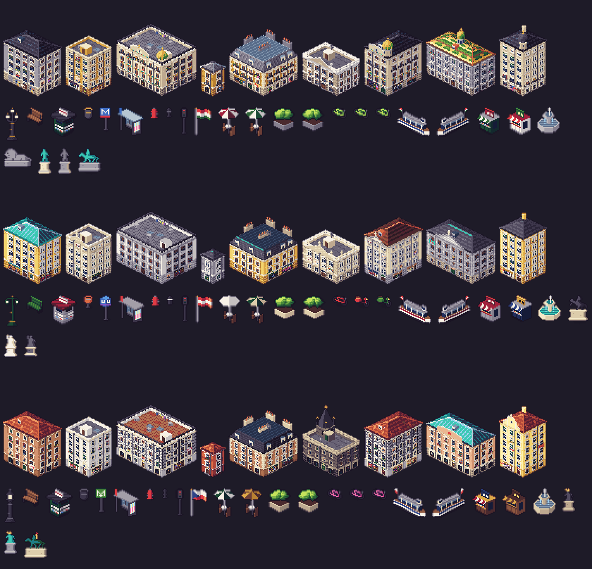
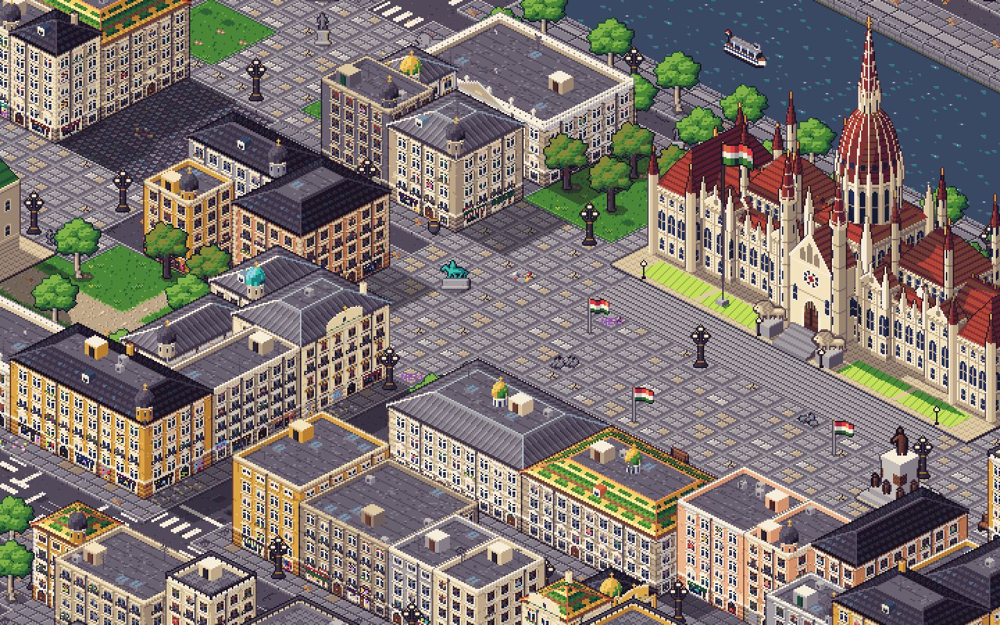
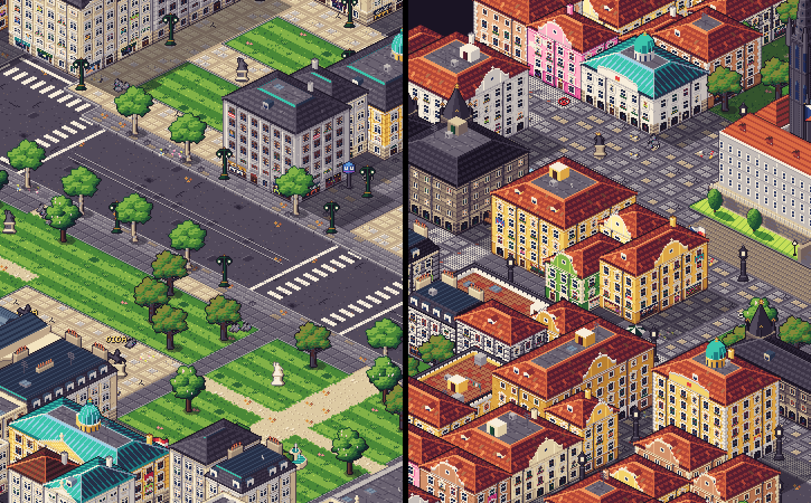

# E3 Central — building styles for Budapest, Vienna and Prague

Each city has its own `EnvCity` (src/art/env/style.ts): ground materials, building looks and
facade modules, roof textures and skyline ornaments, street furniture, city props for every decor
kind its blueprint places, parked cars and city vehicles, graffiti word, protest item, minimap /
postcard / viewer colours. Madrid, London and Paris are pixel-identical (see _Verification_).





## Files

| File                                                                                  | What                                                                                       |
| ------------------------------------------------------------------------------------- | ------------------------------------------------------------------------------------------ |
| `src/art/env/cities/{budapest,vienna,prague}.ts`                                      | the three `EnvCity` styles (+ roof textures, ornament painters, Prague's sgraffito pass)   |
| `src/art/env/cities/{budapest,vienna,prague}.grid.ts`                                 | facade modules and prop grids (Prettier-ignored)                                           |
| `src/art/env/cities/central.ts`                                                       | prop builders shared by the three: moored river boat, street stand, stone fountain         |
| `src/art/vehicles/cities/{budapest,vienna,prague}.ts`                                 | trams (shared `tram()` builder in budapest.ts), taxis, Budapest/Vienna buses               |
| `src/art/env/bld/ornaments.ts` (new, shared)                                          | skyline helpers: `gable` + `PROFILES`, `dome`, `prism`, `cone`, `billboard`, `slopeDormer` |
| one line each in `src/art/env/cities/index.ts` and `src/art/vehicles/cities/index.ts` |                                                                                            |

## Shared extension: `RoofStyle.ornament` (optional, backwards compatible)

The shared painters could not draw curved gables, domes, cupolas, attic statues or spires, so E3
Central added one optional hook (style.ts) and its call in `bld/building.ts`:

```ts
roofs: { …, ornament: { headroom: 16, paint(o: OrnamentCtx) { … } } }
```

`paint` runs after the roof with the building's iso canvas (`o.cv`), its look, kind, roof,
footprint, wall height `H`, roof `rise`, fresh dice (the roof's own rolls are unchanged), the bay
layouts and (added by E3 North) the street face `o.street`. `headroom` grows the sprite above the
usual 18 px. Cities without the field take exactly the old code path (headroom 18, no call), so
their sprites are byte-identical. The helpers in `bld/ornaments.ts` are pure and shared with the
other E3 groups.

Also used from the other groups' extensions (no duplicates added): `Look.variant`
(building-type tag), `FacadeStyle.finish` (Prague sgraffito), `CityMats.tram` (tram tracks on
road centre lines, all three cities), `CityMats.fills` (Prague's mosaic pavement), seeded
`props.extra` variants `<kind>.0…n` / `<kind>.i|j` (kiosks, statues, boats) and boat decor.

## Budapest (level 1)

- **Looks** (`variant`): `eclectic` (warm ochre, cream, sand, peach, grey stucco; quoins now and
  then), `soot` (soot-darkened grey and sandstone), `secession` (white/cream with Zsolnay ceramic
  bands, rounded window heads, a curved attic gable with tile inlay), `civic` (ashlar).
- **Facades:** hooded double box windows with a T-mullion and sill consoles; pedimented /
  segmental piano-nobile windows; wrought-iron balconies on stone slabs (first floor 55%);
  arched carriage gates into the gangház courtyards; barred ground-floor windows; shopfronts in
  stone portals, with awnings, and presszó / ruin-bar fronts; rolled shutters with pasted
  posters (Erzsébetváros), tags. Hung tricolours.
- **Roofs** (`slopeTex`): dark natural slate, grey tin with standing seams, and Zsolnay glazed
  tiles in green / ochre / brown courses with lozenges (civic roofs, Secession houses). Dormers.
  **Ornaments:** corner cupolas on drums (slate, copper or Zsolnay onion domes) with gilt
  finials; civic: central lantern dome and ridge cresting, or a pediment and attic statues.
- **Ground:** grey granite slabs and setts, pale Kossuth tér paving, granite quays with stone
  balustrades, grey-blue Danube, tram tracks (the No. 2 runs on the embankment).
- **Props:** three-lantern cast-iron candelabra, BKV blue M sign with the M2 red band, cast-iron
  bollards, lime MOL Bubi bikes, red-white-green flags; extras: Chain Bridge lions
  (`statue.lion`), verdigris and stone statues, Rákóczi-style equestrian, stone fountain, Danube
  sightseeing boat (`boat.i/j`), trafik and lángos stands (`kiosk.0/1`).
- **Vehicles:** `tram_budapest` (yellow, white band, pantograph), `taxi_budapest` (yellow),
  `bus_budapest` (BKV blue). Tag **NEM**, protest item `phone` (the phone-torch protests), minimap
  slate grey.

## Vienna

- **Looks:** `palais` (civic: cream, white, pale grey, Schönbrunn yellow ashlar), `ring`
  (rusticated Ringstraße blocks), `gruender` (Gründerzeit). Copper (`zinc` → verdigris) on civic
  roofs, dark grey slate with copper ridge capping, a few dull clay-tile roofs.
- **Facades:** 10-px bay modules with pilasters (lit / shaded strips between the bays); box
  windows with straight hoods; Beletage windows under alternating triangular and segmental
  pediments; balcony doors behind stone balustrades; attic windows with frieze panels;
  rusticated ground floors with round-headed windows and arched portals; Kaffeehaus fronts
  (dark wood, gilt lettering, café curtains) and shops in stone portals. Hung red-white-red flags.
- **Ornaments:** civic: central pediment with a sculpted tympanum and an acroterion statue,
  marble statues along the attic balustrade, copper dome on a windowed drum with lantern and
  finial; residential: copper corner cupolas, or a central risalit pediment.
- **Ground:** grey granite slabs, light Ring forecourts, striped formal lawns, light gravel,
  green-teal Donaukanal with green iron railings, tram tracks on the Ring.
- **Props:** grey-green Ringstraße candelabra with two hanging lanterns, U-Bahn cube (white U on
  blue, U2 purple band — the real Wiener Linien colours; the brief said white-on-red), orange
  litter bins, green benches, red WienMobil bikes, Litfaß-style columns in the preview; extras:
  rearing equestrian (Heldenplatz), marble and bronze monuments, fountain, Donaukanal boat,
  Würstelstand and Trafik (`kiosk.0/1`).
- **Vehicles:** `tram_vienna` (red-white), `taxi_vienna` (black, roof sign), `bus_vienna` (red).
  Tag **OIDA**, protest item `umbrella`.

## Prague

- **Looks:** `baroque` (salmon, peach, ochre, butter yellow, pink, pale blue-grey, white, a rare
  pistachio), `sgraffito` (Renaissance black-and-white diamond-point rustication, painted by the
  `finish` pass), `gothic` (dark stone ashlar, small mullioned windows), `palace` (civic).
- **Facades:** eared Baroque windows with keystones and geranium boxes; curved-pediment piano
  nobile; arcades (podloubí) on the ground floor with lit shops inside; doors under painted
  house signs; crystal / souvenir shops and pivnice; Czech flags hung from windows.
- **Roofs:** red beaver-tail clay tiles (the sea of red roofs) with dormers on the front slope,
  dark Gothic slate, copper. **Ornaments:** curved Baroque volute gables with an oculus and urn
  on the street face (55% of pitched Baroque houses); Gothic towers with spiky slate spires,
  corner pinnacles and gilt balls (Týn / town-hall silhouette); civic: a St Nicholas-like copper
  dome, segmental pediment with a coat of arms, blackened statues on the attic.
- **Ground:** mosaic pavement (`fills.sidewalk`: small white and grey setts with red-and-dark
  rosettes, seamless across tiles), grey-brown setts, sandstone quays and balustrades, green-grey
  Vltava, tram tracks.
- **Props:** dark Old Town lamp with a big lantern and pointed crown, arrow-M Metro sign on line A
  green, dark bollards and bins, pink Rekola bikes, Czech flag; extras: Charles Bridge saints
  (blackened sandstone, verdigris), St Wenceslas with lance and pennant, fountain, Vltava boat,
  souvenir and trdelník stands.
- **Vehicles:** `tram_prague` (red and cream), `taxi_prague`. Tag **NE**, protest item `bottle`
  (pivo; woke 20%).

## Verification

- `npx vitest run tests/cities-complete.test.ts tests/env-*.test.ts tests/palette-compliance.test.ts`:
  3819 passed (env style, cars, item, tag and decor-prop checks of the three cities included).
- Madrid / London / Paris unchanged: 3122 hashes (every registered non-new-city sprite — props,
  decals, tiles, building samples, previews, vehicles, landmarks — plus 300 random buildings per
  city with lights, shadow, anchors, roof data and climb points) before vs. after: 0 differences.
- Gallery exports (`node tools/export-sprites.mjs --filter budapest|vienna|prague`) and in-game
  shots `shots/e3c-<city>-day-z2-*.png`, `shots/e3c-<city>-night-z4-*.png` (desktop and phone
  portrait) next to the same shots of Madrid.

## Known gaps

- Pitched roofs keep the shared hipped ring with a flat top on deep footprints; Prague's steep
  pitch is suggested by gables, dormers and spires rather than a taller rise.
- Mansard roofs use the slate texture (the shared painter swaps terracotta for slate there).
- No Fiaker prop yet (optional in the brief).
