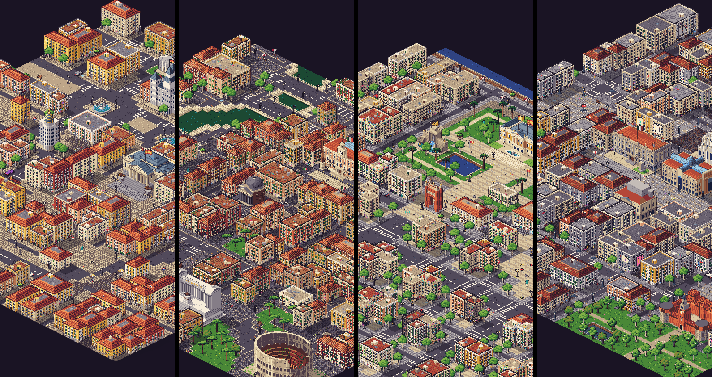
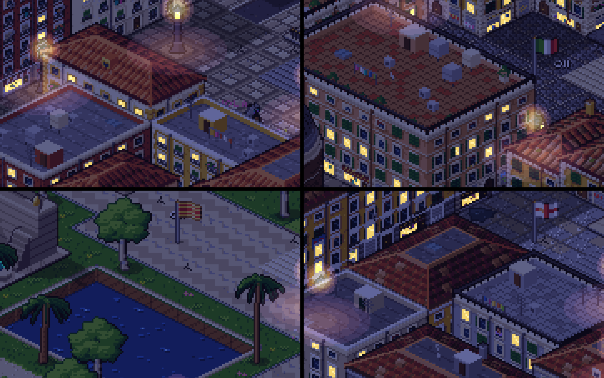
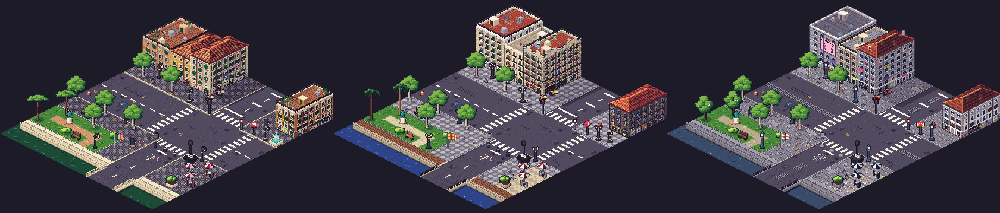

# E3 South — building styles for Rome, Barcelona and Milan

Three environment styles (`EnvCity`, src/art/env/style.ts) replace the Madrid stand-in the
South cities borrowed. Each one has its own ground materials, facades by building kind, roofs,
shopfronts, street furniture, parked cars, protest item, graffiti tag and map/minimap/postcard
colours, and a prop for every decor kind its blueprint places.

In game, phone portrait, zoom 2 — Madrid, Rome, Barcelona, Milan:

Night, zoom 4 — Madrid / Rome (top), Barcelona / Milan (bottom):

Gallery street corners (`env.preview.<city>`) — Rome, Barcelona, Milan:

| File                                                                                  | What                                                                                                                 |
| ------------------------------------------------------------------------------------- | -------------------------------------------------------------------------------------------------------------------- |
| `src/art/env/cities/rome.ts` + `rome.grid.ts`                                         | Rome style + shared South helpers (sett/fan/framed fills, peeling plaster, potted plants, basin fountain, tricolore) |
| `src/art/env/cities/barcelona.ts` + `barcelona.grid.ts`                               | Barcelona style (Panot, Rambla waves, boardwalk, palms, Canaletes, Modernista crests)                                |
| `src/art/env/cities/milan.ts` + `milan.grid.ts`                                       | Milan style (granite, porphyry fans, tram rails, ringhiera, fashion wraps)                                           |
| `src/art/vehicles/cities/{rome,barcelona,milan}.ts`                                   | City vehicles (Fiat 500, Smart, taxis, buses, the Ventotto tram)                                                     |
| one line each in `src/art/env/cities/index.ts` and `src/art/vehicles/cities/index.ts` | registration                                                                                                         |

## Rome — centro storico

- **Walls.** Centro palazzi roll deep ochre (`ochre1`), terracotta (`rust3`), burnt sienna
  (`earth4`), Pompeian red (`rust2`/`rust1`), with paler, more regular Umbertine blocks (Prati,
  Esquilino) for 5+ storey buildings. Travertine trim, travertine-rusticated ground floors on about
  half the buildings, travertine quoins now and then.
- **Facade programme.** Piano nobile with triangular or segmental pediments (`ROM_WIN_PED`,
  `ROM_WIN_SEG`), balustraded or iron balconies on some bays; plain upper floors with a lintel
  cornice; small attic windows under the cornice. **Green persiane** folded open beside the
  frames, shut, or half shut (one leaf). Geraniums in terracotta pots, washing lines across
  windows (Trastevere), hanging tricolori, peeking residents.
- **Finish pass** (`FacadeStyle.finish`): a travertine **marcapiano** at every floor on half the
  buildings, a **cornicione** with modillions under pitched roofs, and **peeling plaster** — ragged
  holes showing brick courses, worst near the street.
- **Ground floor.** Rusticated portone in a travertine arch, botteghe with a travertine frame and a
  half-raised serranda, bar/trattoria fronts with plain canvas awnings and valances, barred
  windows, and closed serrande — usually tagged.
- **Roofs.** Custom `slopeTex` **coppi**: 4 px clay channels down the slope (crown, body, shade,
  gutter), courses wobbling per lane, mottled `rust2`/`rust3`/`earth4`/`rust1` patches, a little
  lichen and moss. Terraces in cotto tiles, plus a `roofs.ornament` painter for **roof gardens**:
  pots along the parapets (some flowering), a lemon tree, a vine pergola or a big cream parasol.
- **Ground.** Sidewalks are **sampietrini** laid diagonally (`settFill`: 4×2 px basalt setts in a
  screen-aligned running bond, i.e. diagonal on the iso ground), with an **SPQR manhole** on one
  detail variant in twelve; cobbled vicoli are sampietrini **fans** (`fanFill`); piazzas are setts
  gridded by thin **travertine guide strips** (`framedFill`). Travertine kerbs, Lungotevere quay
  walls and balustrades; the Tiber in dark jade with teal ripples; terra battuta park paths.
- **Props.** Pastorale lamp (cast-iron crook with a hanging lantern), red Metro **M** square,
  grey AMA bin with a green band, dark iron dissuasori with a travertine ring, green edicola,
  green-iron benches, cream café parasols, tricolore. City props: **nasone** (registered as
  `prop.nasone.rome` and as the city's `hydrant` variant `prop.hydrant.0.rome`, so the blueprint's
  sidewalk hydrants are nasoni), a travertine **basin fountain** for `fountain`, and the
  **Colonna di Marco Aurelio** for `column.gilded` (Piazza Colonna).
- **Cars.** Fiat 500s (mint, red, cream), Smarts (silver, red), white taxis with roof sign, lots of
  Vespas, the red ATAC bus. Tag **BASTA**. Protest item: umbrella.

## Barcelona — Eixample and Ciutat Vella

- **Variants** (`look.variant`, from the footprint: 4-storey / pitched → mostly Ciutat Vella):
  - **Eixample** (`eix`): cream and sandstone (`stone4`, `stone3`, `earth6`, `stone5`, `earth5`),
    ashlar or stucco; a tall **balconera** in every bay with a **wrought-iron balcony on every
    floor**, slatted **persianes de llibret** let down with the foot pushed over the rail or
    rolled up, a low entresòl, a continuous principal balcony on half the buildings, moulded
    cornice with consoles.
  - **Modernista** (`eix+mod`, about one Eixample building in four): **trencadís** over the
    lintels and as a frieze under the cornice, floral string courses, bellied whiplash balconies,
    an **undulating mosaic crest** standing on the street faces and **Gaudí chimneys** (mosaic
    stacks with helmets) on the roof (`roofs.ornament`, with the shared `gable`/`billboard`
    helpers of bld/ornaments.ts).
  - **Gòtic** (`gotic`): narrow windows in dark stone (`stone2`, `stone1`, `earth3`), little iron
    balconies hung with **washing** (38%), plants, soot and damp streaks.
- **Ground floor.** Arched portal with an iron fanlight, carved dark-wood Modernista shops with
  gilded names, bars with folding glass fronts, and metal shutters covered in **painted pieces**
  (two-colour bubble shapes with ink outlines on a coloured ground) plus tags.
- **Ground.** **Panot "flor"** sidewalks (`panotFill`: 2×2 cement tiles per ground tile, each with
  four lit petals and quarter-petal corners), the **Rambla's wavy paving** on plazas
  (`wavesFill`), granite llambordes on cobbled lanes, a **Moll de la Fusta boardwalk** on quays,
  Mediterranean blue water, sandy park paths (sauló), iron railings.
- **Props.** Modernista lamp with two crowned lanterns, red **Metro diamond** with a white M on a
  tall post, red Bicing bikes, grey papereres, TMB bus stops, Senyera flag (the official flag
  only, never partisan ones). City props: **palms** (`tree.round.0-2` → Ciutadella's
  Washingtonia/Phoenix palms; also `tree.palm.0-2` for future blueprint use), the **Font de
  Canaletes** for `wallace`, a stone basin fountain for `fountain`.
- **Cars.** Black-and-yellow taxis with the green roof lamp, the red TMB bus, hatches, scooters.
  Tag **PROU**. Protest item: pot (the cassolada).

## Milan — centro, Brera, Navigli

- **Variants** (`look.variant`):
  - **Neoclassical** (`neo`): grey intonaco and stone (`gray6`, `gray5`, `stone3`), Milan yellow
    and ochre on lower buildings; severe architraves with little cornices, a pedimented piano
    nobile with iron balconies on consoles, small top-floor windows, grey-green persiane, a dark
    cornice band and a string course over the piano nobile.
  - **Rationalist** (`raz`, 5+ storeys): flush square windows in stone cladding with horizontal
    joints, no shutters.
  - **Liberty** (`liberty`): arched windows with whiplash balconettes and a floral frieze.
  - **Casa di ringhiera** (`ringhiera`, low pitched-roof houses — Navigli, Brera): ochre/rust
    walls, a door and window per bay onto a continuous **iron ballatoio** on every floor, washing
    and plants on the rails.
- **Fashion wraps** (`finish`): one face in ten of the centro's big commercial blocks carries a
  giant ad stretched over the facade — brand lettering and striding models.
- **Ground floor.** Rusticated granite portoni, **Quadrilatero boutiques** (black frames, brass
  names, dark awnings), aperitivo bars, saracinesche, barred windows.
- **Roofs.** Custom `slopeTex` **marsigliesi**: regular interlocking tiles, browner and more
  orderly than Rome's coppi; grey flat roofs and pavers, dormers.
- **Ground.** **Granite slab** sidewalks with salt-and-pepper grain (`graniteFill`), **porphyry
  fans** on cobbled lanes, piazzas in granite with stone bands, and **tram tracks**: every road
  centre line (`dashI/J`) carries a double track instead of the painted dash (`CityMats.tram`).
  Navigli water in dark zinc with teal glints, grey quays, iron railings, wet-weather puddles.
- **Props.** Grey-green lamp with the hexagonal lanterna, the **"MM"** totem with the red / green
  / yellow line colours, **panettone** bollards, AMSA hoop bins with see-through bags, dark café
  parasols, yellow BikeMi bikes, Milan's red-cross flag (hanging tricolori on balconies).
- **Cars.** The orange **Ventotto** tram (trolley pole, cream belt, two bogies), white taxis, the
  ATM bus, Fiat 500s, Smarts, scooters. Tag **ZIO**. Protest item: umbrella.

## Shared-code extensions (optional, backwards compatible)

All additive; cities that do not set them are unchanged.

| Hook                                                          | Where                                                    | What                                                                                                                                                               |
| ------------------------------------------------------------- | -------------------------------------------------------- | ------------------------------------------------------------------------------------------------------------------------------------------------------------------ |
| `CityMats.fills?: Partial<Record<PatternGround, GroundFill>>` | src/art/env/ground.ts (`paintGround`)                    | a city's own paving pattern replaces the default fill of sidewalk / cobble / plaza / quay / bridge / parkPath; details, markings, kerbs, edges still drawn over it |
| `CityMats.tram?: { at, rail, railHi, groove }`                | ground.ts (`drawMarking` → `drawTram`)                   | road centre lines get rails instead of the dash                                                                                                                    |
| `FacadeStyle.finish?(c: FacadeFinishCtx)`                     | style.ts, bld/facade.ts (`paintFace`, after the cornice) | city finishing pass with fresh dice: cornices, string courses, peeling plaster, mosaics, ads                                                                       |

Reused from the other E3 agents rather than duplicated: `RoofStyle.ornament` (roof gardens,
Modernista crests, Gaudí chimneys), `bld/ornaments.ts` (`gable`, `billboard`), the
`look(kind, d, site)` footprint argument and `Look.variant`, and seeded `props.extra` variants
(`<kind>.<n>`).

**Proof Madrid / London / Paris are pixel-identical:** a hash of every registered sprite whose
name is not a new city's (2234 entries: tiles, building samples, previews, props, decals,
landmarks, flags, vehicles, UI, protesters) plus the full-map terrain and building art of
Madrid, London and Paris for seeds 0 and 3, computed on commit 9378a00 (before any E3 shared
change) and on the working tree with all E3 changes: **0 differences**.

## Verification

- `tests/cities-complete.test.ts`, `tests/env-ground.test.ts`, `tests/env-buildings.test.ts`,
  `tests/env-props.test.ts`, `tests/palette-compliance.test.ts`, `tests/vehicles-art.test.ts`:
  pass.
- Review renders: building line-ups, prop sheets, terrain patches and previews (`env.preview.<city>`
  in the gallery), in-game screenshots at zoom 2 day and zoom 4 night, desktop and phone portrait,
  next to Madrid.

## Known gaps

- **Eixample chamfers** are in the map (xamfrà plazas) but the buildings are still boxes: cutting
  a chamfered corner needs a geometry change in bld/building.ts.
- **Palms by the port**: the blueprint lines the seafront with `tree.plane`; Barcelona registers
  `tree.palm.0-2`, so Passeig de Colom / Joan de Borbó only need `trees: 'tree.palm'` in the
  blueprint (E2).
- **Navigli towpath railings**: quays draw the shared stone parapet at the water edge; an iron
  rail on quays would need a quay-rail hook.
- Protest items: Rome and Milan use the umbrella (Barcelona the pot). A Vespa mirror, a moka pot
  or a designer handbag would need new items in art/protesters/items.grid.ts (orchestrator).
